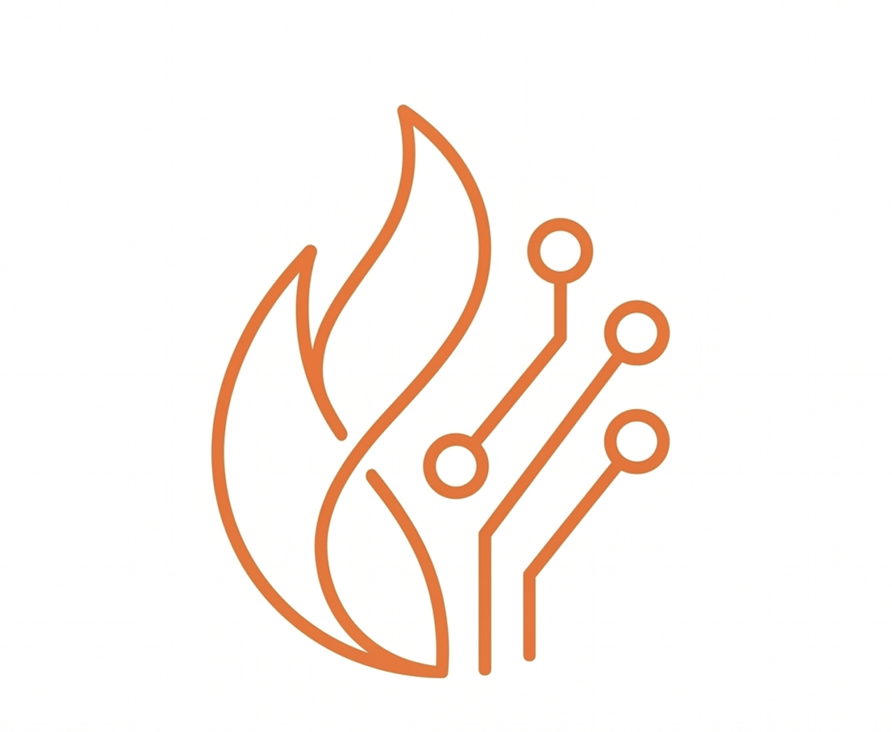
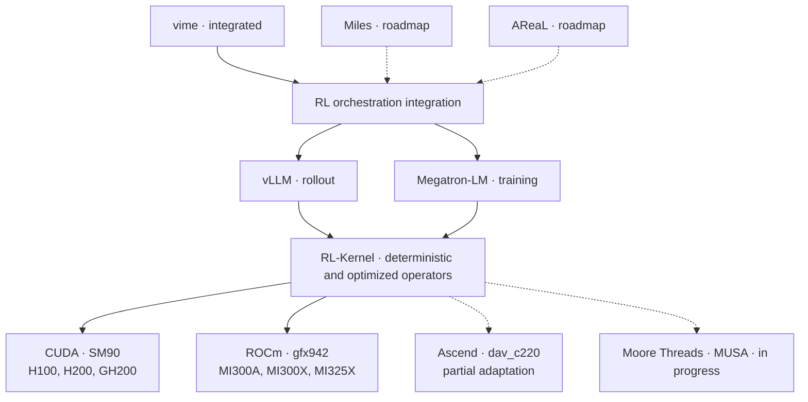
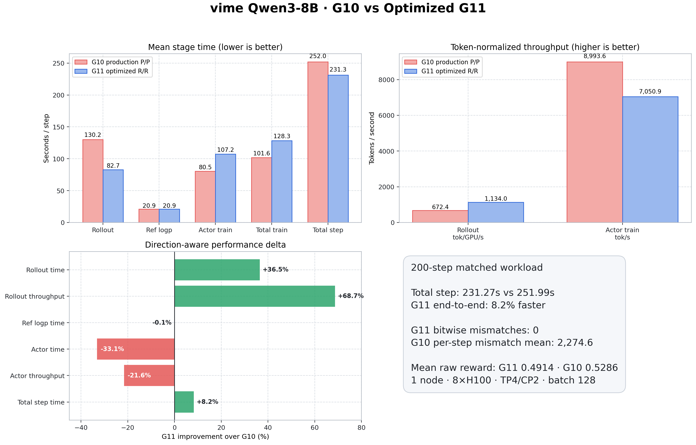

<p align="center">
  
</p>

<h1 align="center">RL-Kernel</h1>

<p align="center">
  <strong>Building cross-hardware and multi-model RL post-training infrastructure for kernel-level train–inference consistency.</strong>
</p>

<p align="center">
  <a href="https://rl-align.github.io/RL-Kernel/"></a>
  <a href="https://rl-align.slack.com/join/shared_invite/zt-46bxj7uyt-gEK3xzwSJr_lppJsZolR~g#/shared-invite/email"></a>
  <a href="https://www.linkedin.com/company/rl-align"></a>
  <a href="https://x.com/RLKernel"></a>
  <a href="./docs/community/wechat.md"></a>
  <a href="./docs/assets/whatsapp-group.png"></a>
  <a href="https://deepwiki.com/RL-Align/RL-Kernel"></a>
  <a href="#hardware-support"></a>
  <a href="https://opensource.org/licenses/Apache-2.0"></a>
</p>

<p align="center">
  <a href="#architecture">Architecture</a> ·
  <a href="#current-scope-and-roadmap">Current scope</a> ·
  <a href="#benchmark-highlights">Results</a> ·
  <a href="#hardware-support">Hardware support</a> ·
  <a href="#quick-start">Quick start</a> ·
  <a href="https://rl-align.github.io/RL-Kernel/">Documentation</a>
</p>

**RL-Kernel** is high-performance infrastructure for RL post-training. It provides
deterministic operators for consistent numerical computation across rollout and training
engines, together with hardware-specific kernels for faster execution and lower memory
use in GRPO, PPO, and related workloads.

Today, the end-to-end path covers **Qwen3-8B Dense with vime, vLLM, and Megatron-LM**.
Work on DeepSeek-V4 Flash MoE, Miles, and AReaL is ongoing.

## Why RL-Kernel?

Rollout and training engines can produce different log probabilities for the same tokens
and model weights because their kernels, batching, and reduction orders differ. Those
differences enter the policy ratios and KL terms used by RL algorithms.

- **Exact train–inference consistency:** deterministic operators keep rollout and training
  computations aligned. The published experiment records exact runtime LogP agreement
  across all 200 training steps.
- **RL operators:** deterministic attention, dense FFN, LogP, GRPO and PPO objectives,
  and collectives cover the numerical boundaries in RL post-training.
- **Performance:** fused computation and hardware-specific kernels reduce rollout time,
  memory use, and synchronization costs.
- **vime integration:** vime orchestrates vLLM rollout and Megatron-LM training, with
  RL-Kernel supplying the operators used by both engines.
- **Hardware:** NVIDIA SM90 and AMD gfx942 are supported. Ascend dav_c220 has partial
  operator coverage. Support for other hardware is in progress.

## Architecture

RL-Kernel sits between execution engines and accelerator backends. Its runtime adapters
select the operator implementation for each backend while keeping the same numerical
contract across rollout and training.

The architecture below shows how orchestration frameworks, execution engines, RL-Kernel
operators, and hardware backends fit together.

<p align="center">
  
</p>

The smaller diagram shows the current vime integration and the planned Miles and AReaL
integrations.



The benchmark below uses **vime, vLLM, Megatron-LM, and CUDA**. See
[runtime dispatch](./docs/design/runtime-dispatch.md) for operator selection.

## Current Scope and Roadmap

The current end-to-end path uses Qwen3-8B Dense with vime.

| Area | Current | Next |
| :--- | :--- | :--- |
| **Model** | Qwen3-8B Dense | [DeepSeek-V4-Flash-0731 MoE](./docs/blog/2026-08-09-dsv4-flash-moe-consistency-roadmap.md) |
| **Orchestration** | vime | Miles and AReaL |
| **Engines** | vLLM rollout and Megatron-LM training | More rollout and training engines |

## Benchmark Highlights

### vime native vs. RL-Kernel + vime

[PR #377](https://github.com/RL-Align/RL-Kernel/pull/377) compares vime native G10 with
RL-Kernel G11. Both runs use vime, vLLM rollout, Megatron-LM training, and rollout LogP
reuse. G11 uses RL-Kernel attention, FFN, and LogP in rollout and training.

**Setup:** Qwen3-8B BF16 · GRPO · 1 node with 8×H100 80GB · actor TP4, CP2, PP1 ·
two TP4 rollout engines · 8 prompts × 16 samples (batch 128) · 200 steps · seed 1234 ·
maximum response length 7,168 · KL-loss coefficient 0.001.

| Metric | vime native (G10) | vime + RL-Kernel (G11) | G11 result |
| :--- | ---: | ---: | :--- |
| Steps with nonzero train–rollout LogP mismatch | 200 of 200 | **0 of 200** | **Exact agreement at every step** |
| Maximum absolute Δlogp across the run | 1.591547 | **0** | **Zero measured difference** |
| Mean rollout time | 130.22 seconds per step | **82.75 seconds per step** | **36.5% lower** |
| Mean rollout throughput | 672.39 tokens per GPU per second | **1,134.00 tokens per GPU per second** | **68.7% higher** |
| Mean reference LogP time | 20.90 seconds per step | 20.92 seconds per step | Approximately equal |
| Mean actor training time | **80.51 seconds per step** | 107.18 seconds per step | 33.1% higher |
| Mean end-to-end step time | 251.99 seconds per step | **231.27 seconds per step** | **8.2% lower** |

G11 saves **47.47 seconds per rollout step**, offsetting the additional actor training
cost for a net saving of **20.72 seconds per end-to-end step**.



## Hardware Support

RL-Kernel currently supports the following hardware targets.

| Hardware | Architecture | Software | Status |
| :--- | :--- | :--- | :--- |
| NVIDIA H100, H200, GH200 | SM90 | CUDA | **Supported** |
| AMD Instinct MI300A, MI300X, MI325X | gfx942 | ROCm | **Supported** |
| Huawei Ascend dav_c220 | dav-2201 | CANN 9.1.0 and Ascend C | **Partial** |
| Moore Threads | In development | MUSA | **In progress** |

The published end-to-end benchmark was run on H100. The ROCm extension and backend
checks were verified on MI300X. Ascend support is limited to dav_c220. Support for other
hardware models is in progress.

## Quick Start

Install Python 3.10 or newer, a PyTorch build matching your accelerator runtime, and the
corresponding CUDA or ROCm compiler toolchain. Then clone RL-Kernel:

```bash
git clone https://github.com/RL-Align/RL-Kernel.git
cd RL-Kernel
```

For the Qwen3-8B train–rollout command and setup for vime with RL-Kernel, see the
[8×H100 integration runbook](https://github.com/RL-Align/RL-Kernel/issues/342).

### NVIDIA CUDA

Build against a visible NVIDIA GPU. Set TORCH_CUDA_ARCH_LIST when you want to pin the
target architecture instead of relying on device detection.

```bash
# NVIDIA SM90: H100, H200, GH200
MAX_JOBS=8 \
RL_KERNEL_REQUIRE_EXT=1 \
TORCH_CUDA_ARCH_LIST="9.0+PTX" \
  python3 -m pip install --no-build-isolation --no-deps -e .
```

The CUDA build targets SM90 and has been tested on an NVIDIA H100 80GB HBM3. H100, H200,
and GH200 use SM90. Support for other CUDA architectures is in progress.

Verify the loaded extension, GPU, SM capability, and required native symbol:

```bash
python3 -c "import torch, rl_engine._C as C; print('GPU:', torch.cuda.get_device_name(0)); print('Capability:', torch.cuda.get_device_capability(0)); print('Extension:', C.__file__); print('fused_logp:', hasattr(C, 'fused_logp')); assert hasattr(C, 'fused_logp'); print('H100 build: PASS')"
```

### AMD ROCm

The gfx942 build targets AMD Instinct MI300A, MI300X, and MI325X:

```bash
PYTORCH_ROCM_ARCH=gfx942 python3 setup.py develop
```

Verify the ROCm environment and required native symbol:

```bash
python3 scripts/check_rocm_env.py
python3 -c "import torch, rl_engine._C as C; print('GPU:', torch.cuda.get_device_name(0)); print('HIP:', torch.version.hip); print('Extension:', C.__file__); print('fused_logp:', hasattr(C, 'fused_logp')); assert hasattr(C, 'fused_logp'); print('MI300X build: PASS')"
```

The extension and environment checks have been tested on AMD Instinct MI300X. Support for
other ROCm architectures is in progress.

For CPU-only or pure-Python development, use an editable pip installation. Ascend has
partial operator support on dav_c220 with the dav-2201 target. Moore Threads support is
in progress. See the [installation guide](./docs/getting_started/installation.md) for
backend dependencies and troubleshooting.

## Community and Contributions

Join us on [Slack](https://rl-align.slack.com/join/shared_invite/zt-46bxj7uyt-gEK3xzwSJr_lppJsZolR~g#/shared-invite/email)
or [WeChat](./docs/community/wechat.md), and
[open an issue](https://github.com/RL-Align/RL-Kernel/issues) for bugs and feature requests.
Contributions to kernels, framework integrations, hardware adaptation, and benchmarks
are welcome. See the [contributing guide](./docs/contributing/README.md).

## Acknowledgments

RL-Kernel builds on the work of the open-source AI infrastructure community, including
[vime](https://github.com/vllm-project/vime), [vLLM](https://github.com/vllm-project/vllm),
[Megatron-LM](https://github.com/NVIDIA/Megatron-LM),
[DeepSpeed](https://github.com/deepspeedai/DeepSpeed), and
[FlashInfer](https://github.com/flashinfer-ai/flashinfer).
We thank their contributors and everyone helping bring RL-Kernel to new accelerators.

Licensed under the [Apache License 2.0](./LICENSE).
