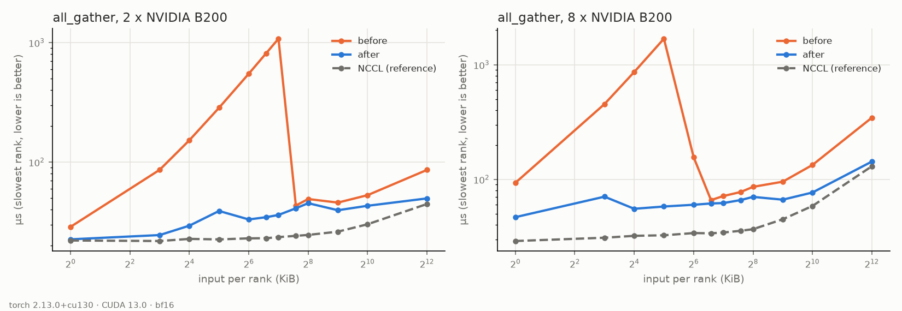

# Deterministic all-gather on B200: before and after

Every value is the median over 100 calls, taken on the slowest rank. The data is BF16, and the
size given is the input per rank. "Before" is `main` at `43f150f` and "after" is `8ccb03c`, both
measured with `benchmarks/benchmark_deterministic_collectives.py`. For each world size, both
builds ran back to back on the same 8 x B200 node. Software: torch 2.13.0, CUDA 13.0.

The recorded NCCL `all_reduce` and `reduce_scatter` rows include per-call tensor cloning
from the original benchmark. Rerun the corrected benchmark for collective-only NCCL
timings of those operations. The all-gather measurements below use preallocated tensors.

| per-rank input | 2 GPUs before | 2 GPUs after | 8 GPUs before | 8 GPUs after | NCCL, 8 GPUs |
| --- | --- | --- | --- | --- | --- |
| 1 KiB | 28.7 µs | 22.6 µs | 93.4 µs | 46.8 µs | 29.0 µs |
| 8 KiB | 86.2 µs | 24.5 µs | 454.1 µs | 70.7 µs | 31.0 µs |
| 32 KiB | 285.2 µs | 39.0 µs | 1688.0 µs | 58.0 µs | 32.5 µs |
| 64 KiB | 549.8 µs | 33.1 µs | 156.3 µs* | 60.1 µs | 34.0 µs |
| 128 KiB | 1079.5 µs | 36.1 µs | 71.6 µs | 62.1 µs | 34.4 µs |
| 256 KiB | 49.1 µs | 45.3 µs | 86.1 µs | 70.4 µs | 36.8 µs |
| 1 MiB | 52.9 µs | 43.1 µs | 133.6 µs | 76.8 µs | 58.6 µs |
| 4 MiB | 86.1 µs | 49.7 µs | 345.5 µs | 143.1 µs | 130.2 µs |

\* An outlier in this run. Every other 8-GPU run of `main` measured 62–63 µs at 64 KiB.

Before this change, every gather whose output was at most 256 KiB ran on a single block that
copied one byte per thread, and its cost grew with the output. After the change:

- every peer's payload moves as 16-byte vectors in one flat loop across peers, when aligned;
- only outputs of at most 64 KiB stay on the single-block path.

`all_reduce`, `reduce_scatter` and `all_gather_many` are not changed. In these runs their before
and after times agree within 4% at every size.
