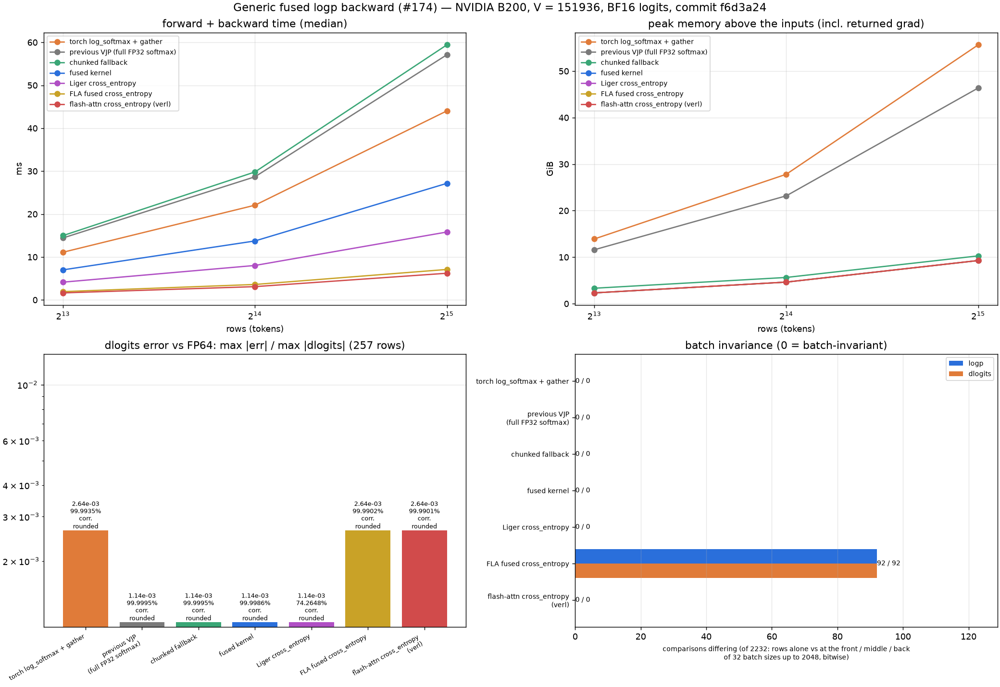

# Fused LogP

Fused LogP computes selected token log probabilities from model logits. It targets RL
post-training workloads where repeated `log_softmax + gather` operations create memory
pressure at large group sizes.

## Entry Point

```python
from rl_engine.kernels.registry import kernel_registry

logp_op = kernel_registry.get_op("logp")
output = logp_op(logits, token_ids)
```

The PyTorch native reference also exposes the Issue #108 interface:

```python
from rl_engine.kernels.ops.pytorch.loss.logp import NativeLogpOp

logp_ref = NativeLogpOp()
output = logp_ref.forward(logits, token_ids)
reference = logp_ref.forward_fp32(logits, token_ids)
```

`apply(...)` and `apply_fp32(...)` remain available as backward-compatible aliases.

## Backends

| Backend | Wrapper | Native symbol | Notes |
| --- | --- | --- | --- |
| CUDA SM90 | `FusedLogpSM90Op` | `_C.fused_logp_sm90` | Experimental TMA-oriented path for 2D contiguous bf16 logits on Hopper-class GPUs. It is disabled by default and requires `RL_KERNEL_ENABLE_EXPERIMENTAL_SM90_LOGP=1`; otherwise the wrapper delegates to the CUDA generic fallback. |
| CUDA generic | `FusedLogpGenericOp` | `_C.fused_logp` | Generic compiled extension fallback. |
| Ascend NPU | `FusedLogpAscendOp` | `_C_npu.fused_logp_ascend` | Batch-invariant Ascend C forward: two-pass (row max, then sum-exp) fp32 reduction with a fixed tile order, mirroring the CUDA deterministic kernel. Output is fp32, matching `DeterministicLogpCUDAOp`'s contract; out-of-range targets yield 0.0. |
| PyTorch native | `NativeLogpOp` | None | PyTorch baseline/reference path. |

## Tensor Contract

| Argument | Shape | Dtype | Requirements |
| --- | --- | --- | --- |
| `logits` | `[N, V]` | `bfloat16` for the experimental SM90 fast path; fp16/fp32 use generic fallback | Contiguous, on the target device for the experimental SM90 fast path. |
| `token_ids` / `labels` | `[N]` | Converted to `int32` | Same logical device as `logits`. |
| Output | `[N]` | Backend-defined tensor dtype | One selected log probability per row. |

## Reference Semantics

```python
ref = torch.log_softmax(logits.float(), dim=-1)
ref = torch.gather(ref, dim=-1, index=token_ids.unsqueeze(-1).long()).squeeze(-1)
```

## Backward evidence (generic CUDA op)



[`report.json`](../usage/evidence/fused-logp-backward-b200/report.json) was written by
`benchmarks/fused_logp_backward_evidence.py --flash-attn-src <flash-attention checkout>` from a
clean tree at `f6d3a24`, on an otherwise idle B200 (torch 2.13.0+cu130, triton 3.7.1,
liger-kernel 0.8.4, fla-core 0.5.2, flash-attention `94e22c9`). V = 151936, BF16 logits.

| 32768 rows | torch `log_softmax` + gather | chunked fallback | fused kernel | Liger CE | FLA CE | flash-attn CE (verl) |
|---|---|---|---|---|---|---|
| forward + backward | 44.0 ms | 59.4 ms | 27.2 ms | 15.8 ms | 7.1 ms | **6.2 ms** |
| backward only | 19.3 ms | 44.8 ms | 12.5 ms | 11.3 ms | 3.7 ms | **3.7 ms** |
| peak memory (incl. returned grad) | 55.6 GiB | 10.3 GiB | **9.3 GiB** | **9.3 GiB** | **9.3 GiB** | **9.3 GiB** |
| `dlogits` max error / max, vs FP64 | 2.6e-3 | 1.1e-3 | 1.1e-3 | 1.1e-3 | 2.6e-3 | 2.6e-3 |
| `dlogits` correctly rounded | 99.994% | 99.9995% | 99.9986% | 74.3% | 99.990% | 99.990% |
| batch-size sweep, logp / `dlogits` differing (of 2232) | 0 / 0 | 0 / 0 | 0 / 0 | 0 / 0 | **92 / 92** | 0 / 0 |

- The CE columns are existing implementations of the same computation (logp = -loss of a
  per-token cross entropy). flash-attn's Triton `cross_entropy_loss` is the kernel verl's
  `logprobs_from_logits` calls when flash-attn is installed.
- flash-attn's and Liger's kernels are batch-invariant, need the same memory as the fused
  kernel, and are faster: flash-attn's by 4.4× forward + backward and 3.4× on the backward
  alone. FLA's is not batch-invariant: a few percent of rows change by one FP32 ulp with the
  batch size.
- What the fused kernel adds over flash-attn's: a smaller `dlogits` error (max 1.1e-3 vs
  2.6e-3 of the largest gradient; 99.9986% vs 99.990% of elements correctly rounded) and no
  Triton or flash-attn dependency. The generic op's forward
  (`_C.fused_logp`, unchanged here) returns BF16 logp, while the CE kernels return FP32.
- The batch-size sweep compares eight rows alone with the same rows at the front, middle and
  back of batches of every size 1..9 and 2^k-1 / 2^k / 2^k+1 up to 2048, over three seeds;
  `row_invariance` in the report (256 rows of a 4096-row batch) agrees.
- The FP64 reference is fed the same upstream gradient each path receives (the generic op's
  forward returns BF16, the torch and CE paths FP32), so the error rows compare like with like.

## Tests

```bash
python -m pytest tests/test_logp.py -q
python -m pytest tests/test_op_accuracy.py -q
```

`tests/test_logp.py` covers the PyTorch reference contract, dtype behavior,
backward-compatible aliases, batch invariance, and registry dispatch. The existing
operator accuracy tests continue to validate native/CUDA fused API compatibility.

## Implementation Files

- `rl_engine/kernels/registry.py`
- `rl_engine/kernels/ops/pytorch/loss/logp.py` — PyTorch native reference
- `rl_engine/kernels/ops/cuda/loss/logp.py` — CUDA fused LogP (SM90 + generic)
- `rl_engine/kernels/ops/ascend/loss/logp.py` — Ascend deterministic op
- `csrc/ops.cpp`
- `csrc/fused_logp_kernel.cu`
- `csrc/cuda/fused_logp_sm90.cu`
- `csrc/deterministic_logp_kernel.cu` — CUDA deterministic kernel (reference reduction)
- `csrc/ascend/fused_logp_ascend.asc` — Ascend C forward kernel
- `csrc/ascend/npu_module.cpp` — shared pybind entry for `rl_engine._C_npu`
- `tests/test_logp.py`
- `tests/test_logp_ascend.py` — Ascend correctness + batch-invariance tests
