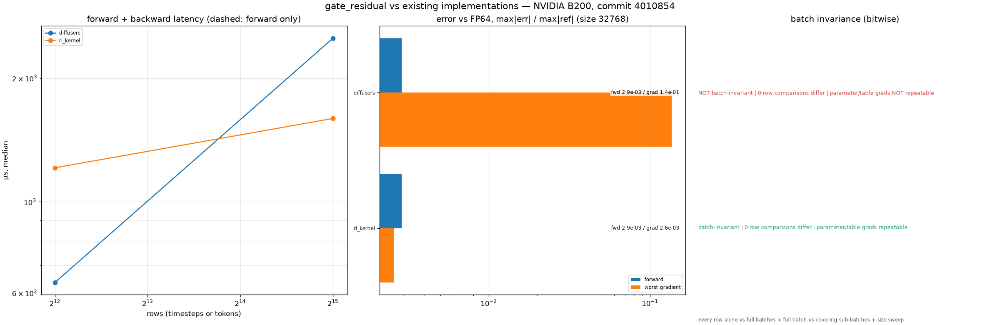

# MiniMax-H3 AdaLN Gated Residual

## Summary

`adaln_gate_residual` adds each sublayer's output back to the residual stream through the
per-row AdaLN gate (RFC #420, WS1 step 6). In every H3 block this happens twice, after attention
with `gate_msa` and after the FFN with `gate_mlp`:

```text
hidden = residual + gate[adaln_indices] * sublayer_output      # RFC #420 §4 order
```

`gate` is an `(R, H)` row view of the [AdaLN projection](h3-adaln-projection.md) table. The op
gathers the gate row inside the kernel, so the gathered `(S, H)` gate is never materialised.

## Entry Point

```python
from rl_engine.runtime.registry import kernel_registry

op = kernel_registry.get_op("adaln_gate_residual", device="cuda")
hidden = op(residual, attn_output, gate_msa, adaln_indices)
```

## Backends

| Backend | Wrapper | Native symbols | Status |
| --- | --- | --- | --- |
| CUDA | `rl_engine.backends.cuda.model_specific.minimax_h3.gate_residual.H3GateResidualCudaOp` | `rl_engine._C.h3_gate_residual_{forward,backward}` | Forward and `d_sublayer` bitwise equal to diffusers |
| PyTorch reference | `rl_engine.reference.minimax_h3.gate_residual.NativeH3GateResidualOp` | n/a | Eager forward with a deterministic gate gradient; `forward_fp32`: FP64 golden |
| ROCm | n/a | n/a | Falls back to the PyTorch reference |

## Tensor Contract

| Argument | Shape | Dtype | Requirements |
| --- | --- | --- | --- |
| `residual`, `sublayer_output` | `(..., S, H)` | bf16 / fp16 / fp32 | Same shape and dtype |
| `gate` | `(R, H)` row view | same | Unit column stride |
| `index` | `(S,)` | int64 | In `[0, R)`; shared across the batch |

## Numerics

- **Forward.** Each element computes `p = round(gate * y)` and then `out = round(residual + p)`.
  `__fmul_rn`/`__fadd_rn` keep FP32 from contracting the two operations into one FMA. The
  roundings fall exactly where the eager expression rounds, so the forward is **bitwise equal to
  diffusers** in BF16, FP16 and FP32. Rows are independent.
- **Backward.**
  - `d_residual` is the incoming gradient.
  - `d_sublayer = round(grad * gate)`. The product of two 16-bit values is exact in FP32, so this
    is bitwise equal to the eager VJP.
  - `d_gate` is an FP32 segmented sum of `grad * sublayer_output` over positions sorted stably
    by table row, using the same tiles as [`adaln_row_gather`](h3-adaln-row-gather.md), rounded
    once.

  Diffusers' `d_gate` uses `index_select`'s BF16 atomic scatter-add instead. It is
  non-deterministic and 13–49× further from the FP64 golden (its error varies from run to run).

## Performance Notes

```bash
python benchmarks/models/benchmark_h3_conditioning.py --op adaln_gate_residual
```

B200, B = 1, H = 5376, BF16. Backward timings exclude input and forward-graph setup:

| S | CUDA fwd | diffusers fwd | CUDA bwd | diffusers bwd |
| --- | --- | --- | --- | --- |
| 4097 | 0.07 ms | 0.09 ms | 1.12 ms | 0.58 ms |
| 32768 | 0.24 ms | 0.42 ms | 1.12 ms | 2.24 ms |
| 131072 | 0.88 ms | 1.61 ms | 2.22 ms | 8.92 ms |

The forward is one pass over `residual` and `sublayer_output`, using 16-byte vectors with one
block per row. At small S the backward pays a fixed cost of about 1 ms for the stable sort and
tile setup.

## Evidence


The data is in [`report.json`](../../reports/experiments/h3-adaln-gate-residual-b200/report.json),
written by `tools/validation/models/h3_evidence.py` from a clean tree at commit `bde1d8d`. It also records
forward bitwise equality with diffusers in bf16, fp16 and fp32, and row invariance.

## Existing implementations (RFC #420 reuse rule)



| Implementation | Batch-invariant | size 4097: fwd err / worst grad err / fwd+bwd | size 32768: fwd err / worst grad err / fwd+bwd |
|---|---|---|---|
| diffusers residual + gate.index_select(...) * y | **no** (param/table grads not repeatable) | 3.0e-03 / 4.3e-02 / 637 µs | 2.9e-03 / 1.4e-01 / 2502 µs |
| rl-kernel H3GateResidualCudaOp | yes | 3.0e-03 / 2.6e-03 / 1210 µs | 2.9e-03 / 2.6e-03 / 1596 µs |

Errors are max|err| / max|ref| against the same computation in FP64; latency is the median
forward + backward time on an otherwise idle B200. Batch invariance is bitwise and covers
three checks: every row computed alone vs inside full batches of 64, 257 and 2048 rows; the full
131072-row batch vs sub-batches that together cover every row; and a dense batch-size sweep. A
"no" means that at least one row, sub-batch or gradient differed. [`gate_residual.json`](../../reports/experiments/h3-prior-art-b200/gate_residual.json)
was written from a clean tree at `4010854` by

```bash
python tools/validation/models/h3_prior_art.py --op gate_residual --out reports/experiments/h3-prior-art-b200/gate_residual.json
python tools/validation/models/plot_h3_prior_art.py reports/experiments/h3-prior-art-b200/gate_residual.json
```

Libraries that do not import are skipped and recorded as unavailable in the report.

## Tests

```bash
export RL_KERNEL_H3_WEIGHTS=<dir written by tools/weights/prepare_h3_weights.py>
python -m pytest tests/models/minimax_h3/test_h3_adaln_gate_residual.py -v   # operator
python -m pytest tests/models/minimax_h3/test_h3_conditioning_e2e.py -v      # end to end, incl. the gated residual
python tools/validation/operators/check_operator.py --op adaln_gate_residual --candidate cuda --device cuda \
    --dtype bf16 --batch 3 --seq 1365 --normalized-dim 5376 --check-grad
python tools/validation/models/h3_evidence.py --op adaln_gate_residual \
    --out reports/experiments/h3-adaln-gate-residual-b200/report.json
python tools/validation/models/plot_h3_evidence.py reports/experiments/h3-adaln-gate-residual-b200/report.json
```

## Known Limitations

- Until the attention and FFN rows land, the end-to-end chain feeds a seeded stand-in for the
  sublayer output. The op itself is exercised on random and pinned-table inputs.
- There is no ROCm kernel. ROCm dispatches the PyTorch reference.
