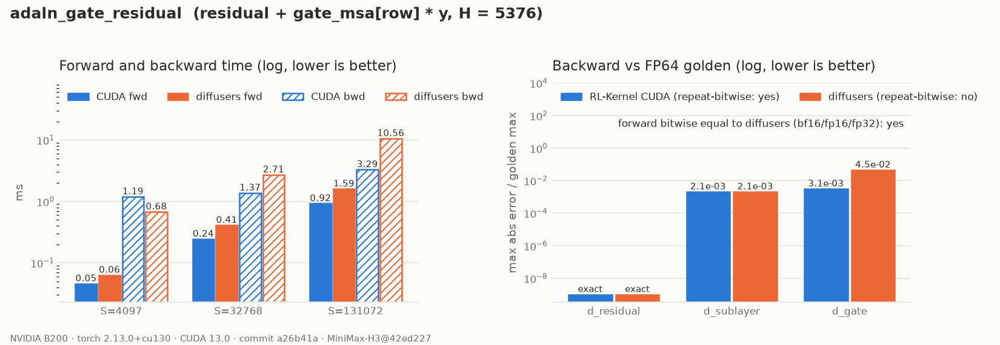

# MiniMax-H3 AdaLN Gated Residual

## Summary

`adaln_gate_residual` adds each sublayer's output back to the residual stream through the
per-row AdaLN gate (RFC #420, WS1 step 6). In every H3 block this happens twice, after attention
with `gate_msa` and after the FFN with `gate_mlp`:

```text
hidden = residual + gate[adaln_indices] * sublayer_output      # RFC #420 §4 order
```

`gate` is an `(R, H)` row view of the [AdaLN projection](h3-adaln-projection.md) table. The op
gathers the gate row inside the kernel, so the gathered `(S, H)` gate is never materialised.

## Entry Point

```python
op = kernel_registry.get_op("adaln_gate_residual", device="cuda")
hidden = op(residual, attn_output, gate_msa, adaln_indices)
```

## Backends

| Backend | Wrapper | Native symbols | Status |
| --- | --- | --- | --- |
| CUDA | `rl_engine.kernels.ops.cuda.h3.gate_residual.H3GateResidualCudaOp` | `rl_engine._C.h3_gate_residual_{forward,backward}` | Forward and `d_sublayer` bitwise equal to diffusers |
| PyTorch reference | `rl_engine.kernels.ops.pytorch.h3.gate_residual.NativeH3GateResidualOp` | n/a | Eager forward with a deterministic gate gradient; `forward_fp32`: FP64 golden |
| ROCm | n/a | n/a | Falls back to the PyTorch reference |

## Tensor Contract

| Argument | Shape | Dtype | Requirements |
| --- | --- | --- | --- |
| `residual`, `sublayer_output` | `(..., S, H)` | bf16 / fp16 / fp32 | Same shape and dtype |
| `gate` | `(R, H)` row view | same | Unit column stride |
| `index` | `(S,)` | int64 | In `[0, R)`; shared across the batch |

## Numerics

- **Forward.** Each element computes `p = round(gate * y)` and then `out = round(residual + p)`.
  `__fmul_rn`/`__fadd_rn` keep FP32 from contracting the two operations into one FMA. The
  roundings fall exactly where the eager expression rounds, so the forward is **bitwise equal to
  diffusers** in BF16, FP16 and FP32. Rows are independent.
- **Backward.**
  - `d_residual` is the incoming gradient.
  - `d_sublayer = round(grad * gate)`. The product of two 16-bit values is exact in FP32, so this
    is bitwise equal to the eager VJP.
  - `d_gate` is an FP32 segmented sum of `grad * sublayer_output` over positions sorted stably
    by table row, using the same tiles as [`adaln_row_gather`](h3-adaln-row-gather.md), rounded
    once.

  Diffusers' `d_gate` uses `index_select`'s BF16 atomic scatter-add instead. It is
  non-deterministic and 13–49× further from the FP64 golden (its error varies from run to run).

## Performance Notes

```bash
python benchmarks/benchmark_h3_conditioning.py --op adaln_gate_residual
```

B200, B = 1, H = 5376, BF16:

| S | CUDA fwd | diffusers fwd | CUDA bwd | diffusers bwd |
| --- | --- | --- | --- | --- |
| 4097 | 0.05 ms | 0.06 ms | 1.19 ms | 0.68 ms |
| 32768 | 0.24 ms | 0.41 ms | 1.37 ms | 2.71 ms |
| 131072 | 0.92 ms | 1.59 ms | 3.29 ms | 10.6 ms |

The forward is one pass over `residual` and `sublayer_output`, using 16-byte vectors with one
block per row. At small S the backward pays a fixed cost of about 1 ms for the stable sort and
tile setup.

## Evidence



The data is in [`report.json`](../usage/evidence/h3-adaln-gate-residual-b200/report.json),
written by `scripts/h3_evidence.py` from a clean tree at commit `a26b41a`. It also records
forward bitwise equality with diffusers in bf16, fp16 and fp32, and row invariance.

## Tests

```bash
export RL_KERNEL_H3_WEIGHTS=<dir written by scripts/prepare_h3_weights.py>
python -m pytest tests/h3/test_h3_adaln_gate_residual.py -v   # operator
python -m pytest tests/h3/test_h3_conditioning_e2e.py -v      # end to end, incl. the gated residual
python scripts/check_operator.py --op adaln_gate_residual --candidate cuda --device cuda \
    --dtype bf16 --batch 3 --seq 1365 --normalized-dim 5376 --check-grad
python scripts/h3_evidence.py --op adaln_gate_residual \
    --out docs/usage/evidence/h3-adaln-gate-residual-b200/report.json
python scripts/plot_h3_evidence.py docs/usage/evidence/h3-adaln-gate-residual-b200/report.json
```

## Known Limitations

- Until the attention and FFN rows land, the end-to-end chain feeds a seeded stand-in for the
  sublayer output. The op itself is exercised on random and pinned-table inputs.
- There is no ROCm kernel. ROCm dispatches the PyTorch reference.
