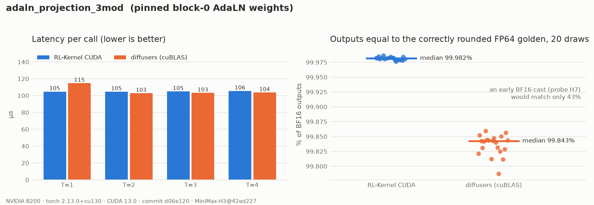
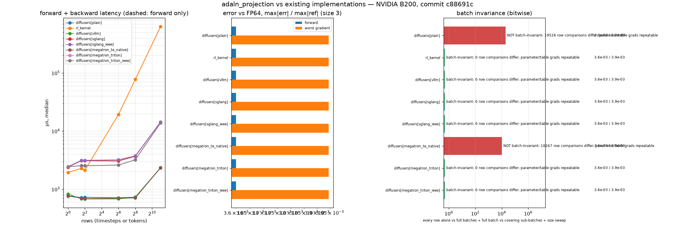

# MiniMax-H3 Three-Modality AdaLN Projection

## Summary

`adaln_projection_3mod` is the per-block `MiniMaxH3AdaLayerNormModulation`
(RFC #420, WS1 step 3). It turns the shared FP32 timestep embedding into the six
modulation tensors of one transformer block, for all three modalities:

```text
act   = silu(temb).to(bf16)                         SiLU in FP32, one declared cast
table = act @ W.T + b                               (T, 96768) BF16, W: (96768, 2688)
rows  = table.view(3T, 32256)                       row t * 3 + m, m: 0 video, 1 text, 2 audio
shift_msa, scale_msa, gate_msa, shift_mlp, scale_mlp, gate_mlp = rows.chunk(6, -1)   # (3T, 5376) each
```

Projection output channel `o = m * 32256 + c * 5376 + h` is chunk `c`, hidden index `h`
of modality `m`. The table rows are laid out `[t0m0, t0m1, t0m2, t1m0, ...]`. That is the
layout `adaln_row_gather` addresses with `timestep_indices * 3 + token_tags`.

Pinned model: `MiniMaxAI/MiniMax-H3@42ed227`, `transformer_blocks.0.adaln_proj.linear`
(BF16 weight and bias). All 50 blocks have the same shape.

## Entry Point

```python
from rl_engine.kernels.registry import kernel_registry

op = kernel_registry.get_op("adaln_projection_3mod", device="cuda")
shift_msa, scale_msa, gate_msa, shift_mlp, scale_mlp, gate_mlp = op(temb, weight, bias)
table = op.forward_table(temb, weight, bias)   # raw (T, 96768) for a fused gather
```

## Backends

| Backend | Wrapper | Native symbols | Status |
| --- | --- | --- | --- |
| CUDA (SM80+, validated on SM100) | `rl_engine.kernels.ops.cuda.h3.adaln_projection.H3AdaLNProjectionCudaOp` | `rl_engine._C.h3_det_linear_*` | BF16 weights: contract `h3-det-linear-bf16-mma-v1`; FP32 weights: `h3-det-linear-v1` |
| PyTorch reference | `rl_engine.kernels.ops.pytorch.h3.adaln_projection.NativeH3AdaLNProjectionOp` | n/a | `forward`: provider path; `forward_fp32`: declared-cast FP64 golden |
| ROCm | n/a | n/a | Falls back to the PyTorch reference |

## Tensor Contract

| Argument | Shape | Dtype | Requirements |
| --- | --- | --- | --- |
| `temb` | `(T, D)`, `T >= 1` | float32 | H3: `D = 2688`. BF16 is rejected (RFC probe H7) |
| `weight` | `(6 * H * 3, D)` | bfloat16 (checkpoint) or float32 | First dim must be a multiple of 18. H3: `H = 5376` |
| `bias` | `(6 * H * 3,)` | same as `weight` | |
| outputs | six `(3T, H)` views | weight dtype | Views of one `(T, 18H)` table, as in diffusers |

The CUDA kernel needs `D` to be a multiple of 8 for BF16 or 4 for FP32, and BF16 needs SM80+. These inputs fail
closed: a BF16 `temb`, mismatched dtypes or shapes, an empty `temb`, and mixed devices.

## Numerics

- **Mixed-precision boundary.** SiLU runs in FP32 at `temb`'s precision, and the result is
  rounded to BF16 exactly once. These are the provider's own elementwise ops, so the
  activation is bitwise equal to diffusers. Casting before the SiLU (probe H7) is
  rejected at the API. It is also numerically visible: on block 0 it changes about 52% of
  the BF16 outputs.
- **Projection (BF16 weights).** It follows contract `h3-det-linear-bf16-mma-v1` in
  `csrc/cuda/h3/det_linear.cu`:
  - Each warp owns 16 output columns and 8 input rows. Rows past T are zero, so every
    T <= 8 runs the same instruction sequence. A tensor-core column never sees another
    column's data.
  - K is visited in groups of 16 in ascending order. Each `mma.sync m16n8k16` (BF16 in,
    FP32 out) starts from zero, so the tensor core only sums 16 products. Its result is
    added to an FP32 running sum with an IEEE add.
  - Then the bias is added and the result is rounded to BF16 once.

  A timestep's 18 modulation rows are bitwise independent of the other timesteps in the
  call and of their order. Restarting the accumulator for every 16-wide group is what keeps
  accuracy at the level of an FP32 FMA chain. Letting the tensor core accumulate across
  the whole of K, as cuBLAS does, loses about 0.15% of correctly rounded outputs. FP32
  weights use the FMA path of `h3-det-linear-v1` instead, because FP32 on tensor cores
  would mean TF32, which the contract forbids.
- **Golden.** `forward_fp32` computes the SiLU in FP64, rounds it to BF16 at the declared
  boundary (the cast is model semantics), and runs the projection in FP64. It returns
  FP32 without the final rounding. Its gradient stays in FP64 end to end, because the
  cast is applied straight-through (identity VJP). Writing the cast as
  `.to(bf16).double()` would make autograd round the golden's own `d_temb` to BF16.
- **Backward.** No cuBLAS and no atomics. `d_act` is computed with the chunked
  deterministic `grad @ W`, kept in FP32 through the cast (whose VJP is the identity),
  and passed through the FP32 SiLU VJP; it is row-local and batch-invariant.
  `dW` and `db` are ascending-row FP32 folds, rounded to BF16 once. Unlike the provider,
  `d_temb` is not rounded to BF16 on its way through the cast.

Measured on a B200 with the pinned block-0 weights and torch 2.13.0+cu130. Fractions are
medians over 20 random draws of `temb`, with T = 4:

| Comparison | CUDA | provider (cuBLAS) |
| --- | --- | --- |
| outputs equal to the correctly rounded golden | 99.982% (worst draw 99.976%) | 99.842% (worst draw 99.787%) |
| CUDA equal to provider | 99.84% | |
| early-cast golden (probe H7) equal to CUDA | 43% | |
| `d_temb` vs FP64 golden (gtest, T = 3) | max abs 2.3e-5 | 6.1e-2 (`d_act` rounded to BF16) |
| `dW`, `db` vs FP64 golden rounded to BF16 | > 99.9% bitwise equal | |

The contract tolerance is `reduction` / `bfloat16`: atol 5e-2, rtol 2e-2, and atol 1e-1
for gradients.

## Performance Notes

```bash
python benchmarks/benchmark_h3_conditioning.py --op adaln_projection_3mod
```

B200, pinned BF16 weights (520 MB per block, streamed once per call):

| T | CUDA op | provider (SiLU + cast + cuBLAS) | CUDA GEMV kernel | cuBLAS kernel |
| --- | --- | --- | --- | --- |
| 1 | 105 µs | 115 µs | 78.3 µs (6.6 TB/s) | 93 µs |
| 2 | 105 µs | 103 µs | 78.4 µs | 79 µs |
| 4 | 106 µs | 104 µs | 79.0 µs | 79 µs |

The kernel takes the same time for every T <= 8, because it always computes 8 rows. It
matches cuBLAS for T >= 2 and is faster at T = 1. The remaining 24 µs of the op time is
the SiLU and cast kernels plus the Python wrapper. With those included, the op is within
about 2% of the provider for T >= 2.

An earlier FMA-only BF16 kernel ran at 81, 98 and 166 µs for T = 1, 2 and 4. Its time
grew with T because every extra row adds FMAs per weight element. Packed FP32 FMA
(`__ffma2_rn`) gave identical bits but no speedup. Moving to tensor cores removed the
dependence on T.

## Evidence



The data is in [`report.json`](../usage/evidence/h3-adaln-projection-b200/report.json),
written by `scripts/h3_evidence.py` from a clean tree at commit `d06e120`. The report also
records that a timestep's 18 modulation rows are bitwise identical whether it runs alone
or in a batch of 9.

## Existing implementations (RFC #420 reuse rule)



| Implementation | Batch-invariant | size 3: fwd err / worst grad err / fwd+bwd | size 256: fwd err / worst grad err / fwd+bwd | size 2048: fwd err / worst grad err / fwd+bwd |
|---|---|---|---|---|
| diffusers AdaLN projection, BF16 F.linear [plain] | **no** (14214 rows, 3080 sub-batches, 2232 sweep cases) | 3.6e-03 / 3.9e-03 / 716 µs | 3.4e-03 / 3.2e-03 / 728 µs | 3.2e-03 / 3.5e-03 / 2346 µs |
| rl-kernel H3AdaLNProjectionCudaOp | yes | 3.6e-03 / 3.9e-03 / 2276 µs | 3.4e-03 / 3.2e-03 / 77446 µs | 3.2e-03 / 3.5e-03 / 626992 µs |
| diffusers AdaLN projection, BF16 F.linear [vllm] | yes | 3.6e-03 / 3.9e-03 / 681 µs | 3.4e-03 / 3.2e-03 / 722 µs | 3.2e-03 / 3.5e-03 / 2330 µs |
| diffusers AdaLN projection, BF16 F.linear [sglang] | yes | 3.6e-03 / 3.9e-03 / 3096 µs | 3.4e-03 / 3.2e-03 / 3690 µs | 3.2e-03 / 3.5e-03 / 14296 µs |
| diffusers AdaLN projection, BF16 F.linear [sglang_ieee] | yes | 3.6e-03 / 3.9e-03 / 3138 µs | 3.4e-03 / 3.2e-03 / 3740 µs | 3.2e-03 / 3.5e-03 / 14325 µs |
| diffusers AdaLN projection, BF16 F.linear [megatron_te_native] | **no** (7107 rows, 2056 sub-batches, 1104 sweep cases) | 3.6e-03 / 3.9e-03 / 702 µs | 3.4e-03 / 3.2e-03 / 706 µs | 3.2e-03 / 3.5e-03 / 2330 µs |
| diffusers AdaLN projection, BF16 F.linear [megatron_triton] | yes | 3.6e-03 / 3.9e-03 / 2532 µs | 3.4e-03 / 3.2e-03 / 3204 µs | 3.2e-03 / 3.5e-03 / 13771 µs |
| diffusers AdaLN projection, BF16 F.linear [megatron_triton_ieee] | yes | 3.6e-03 / 3.9e-03 / 2533 µs | 3.4e-03 / 3.2e-03 / 3206 µs | 3.2e-03 / 3.5e-03 / 13773 µs |

Errors are max|err| / max|ref| against the same computation in FP64; latency is the median
forward + backward time on an otherwise idle B200. Batch invariance is bitwise and covers
three checks: every row computed alone vs inside full batches of 64, 257 and 2048 rows; the full
4096-timestep batch vs sub-batches that together cover every row; and a dense batch-size sweep. A
"no" means that at least one row, sub-batch or gradient differed. [`adaln_projection.json`](../usage/evidence/h3-prior-art-b200/adaln_projection.json)
was written from a clean tree at `c88691c` by

```bash
python scripts/h3_prior_art.py --op adaln_projection --out docs/usage/evidence/h3-prior-art-b200/adaln_projection.json --megatron-src <Megatron-LM checkout>
python scripts/plot_h3_prior_art.py docs/usage/evidence/h3-prior-art-b200/adaln_projection.json
```

Libraries that do not import are skipped and recorded as unavailable in the report.

## Tests

```bash
export RL_KERNEL_H3_WEIGHTS=<dir written by scripts/prepare_h3_weights.py>
python -m pytest tests/h3/test_h3_adaln_projection.py -v       # operator
python -m pytest tests/h3/test_h3_conditioning_e2e.py -v       # end to end: sinusoid -> MLP -> projection
python scripts/check_operator.py --op adaln_projection_3mod --candidate cuda --device cuda \
    --dtype bf16 --batch 3 --normalized-dim 5376 --check-grad
python scripts/h3_evidence.py --op adaln_projection_3mod \
    --out docs/usage/evidence/h3-adaln-projection-b200/report.json
python scripts/plot_h3_evidence.py docs/usage/evidence/h3-adaln-projection-b200/report.json
```

## Known Limitations

- There is no ROCm kernel. ROCm dispatches the PyTorch reference.
- The BF16 path needs SM80 or newer (`mma.sync`). It is rejected at launch on older GPUs.
- T > 8 runs one more weight pass per 8 rows.
- Sharding the 96768-wide projection (`tp_adaln_3mod`) is a separate WS2 row.
