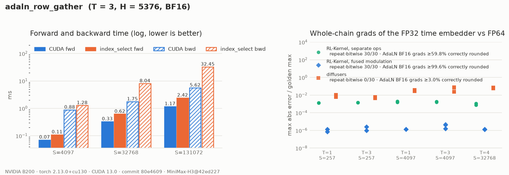

# MiniMax-H3 AdaLN Row Gather

## Summary

`adaln_row_gather` selects every packed-sequence position's six modulation vectors from
one block's AdaLN table (RFC #420, WS1 step 3):

```text
adaln_indices = timestep_indices * 3 + token_tags          (S,)   0 video, 1 text, 2 audio
shift_msa[adaln_indices], scale_msa[...], gate_msa[...],
shift_mlp[...], scale_mlp[...], gate_mlp[...]               six (S, 5376)
```

`rows` is the `(3T, 6H)` view of the [AdaLN projection](h3-adaln-projection.md) table, and
its six column blocks are the six modulation tensors. `timestep_indices` and `token_tags`
are semantic inputs (RFC #420 §4): they are validated, never clamped.

## Entry Point

```python
from rl_engine.kernels.registry import kernel_registry

op = kernel_registry.get_op("adaln_row_gather", device="cuda")
outs = op(table.view(-1, 6 * 5376), timestep_indices, token_tags)    # six (S, 5376)
outs = op.gather_chunks((shift_msa, ..., gate_mlp), timestep_indices, token_tags)  # drop-in
```

## Backends

| Backend | Wrapper | Native symbols | Status |
| --- | --- | --- | --- |
| CUDA (SM90, SM100) | `rl_engine.kernels.ops.cuda.h3.adaln_row_gather.H3AdaLNRowGatherCudaOp` | `rl_engine._C.h3_adaln_row_gather_{forward,backward}` | Forward bitwise equal to `index_select`; deterministic backward |
| PyTorch reference | `rl_engine.kernels.ops.pytorch.h3.adaln_row_gather.NativeH3AdaLNRowGatherOp` | n/a | `index_select` forward; deterministic per-row FP32 backward |
| ROCm | n/a | n/a | Falls back to the PyTorch reference |

The raw diffusers path, including its atomic backward, is kept as
`rl_engine.testing.h3_provider.provider_adaln_row_gather` for evidence.

## Tensor Contract

| Argument | Shape | Dtype | Requirements |
| --- | --- | --- | --- |
| `rows` | `(3T, 6H)` | bf16 / fp16 / fp32 | Unit column stride. Any row stride (16-byte copies when aligned) |
| `timestep_indices` | `(S,)`, `S >= 1` | int64 or int32 | In `[0, T)` |
| `token_tags` | `(S,)` | same as `timestep_indices` | In `{0, 1, 2}` |
| outputs | six `(S, H)` | `rows.dtype` | Contiguous; slices of one `(6, S, H)` buffer |

These inputs fail closed: out-of-range tags (a fourth modality, probe H2) or timesteps
(an offset past `T`, probe H3), length or dtype mismatches, empty sequences, and tables
that are not 3 rows per timestep or 6 blocks wide. The range check is one host
read-back; pass `check_range=False` when the indices are already validated.

## Numerics

- **Forward** is a byte copy: one launch, one block per `(position, chunk)`, using
  16-byte vector copies. It is bitwise equal to diffusers' six `index_select` calls for
  every packing, length and index dtype tested (S up to 131072).
- **Backward**: `d_rows[r] = sum over {s : r[s] = r} of grad[s]` is the op's only
  reduction. Positions are sorted stably by `(row, position)` and cut into tiles of 256.
  Each tile is an ascending FP32 chain from 0, and a row's tiles are left-folded in order
  and rounded once. There are no atomics, so the result depends only on the indices and
  the gradient. `index_select`'s own backward is an atomic scatter-add in the gradient
  dtype (BF16), which is neither deterministic nor accurate.
- **Tolerance class.** The VJP is a segmented reduction, so gtest judges the op as
  `reduction`. The forward is asserted bitwise in `tests/h3`.

Measured on a B200 (torch 2.13.0+cu130):

| Comparison (T = 3, S = 4097, H = 5376, BF16) | CUDA | provider (`index_select`) |
| --- | --- | --- |
| Forward vs `index_select` | bitwise equal | |
| `d_rows` repeat-bitwise | yes | no |
| `d_rows` correctly rounded from the FP64 sum | 99.99965% | 7.8% |
| `d_rows` max abs error vs FP64 | 0.25 (1 ULP) | 4.99 |

### Fused modulation: `H3AdaLNModulationCudaOp`

`rl_engine.kernels.ops.cuda.h3.adaln_modulation.H3AdaLNModulationCudaOp(temb, weight, bias,
timestep_indices, token_tags)` runs [`adaln_projection_3mod`](h3-adaln-projection.md) and
this gather as one autograd node. Its forward uses the same kernels and is bitwise equal
to calling the two ops in sequence.

The difference is in the backward. When the ops are called separately, autograd returns
the gather's FP32 segment sum to the projection in the table's BF16 dtype, which rounds it
once more. The fused node feeds the FP32 table gradient straight into the projection
backward. Use it wherever both ops run back to back, as they do in an H3 block.

### Whole-chain backward

`scripts/h3_chain_replay.py --backward` runs on the pinned weights for
T in {1, 2, 3, 4} × S in {3, 257, 4097, 32768}. It checks six parameter gradients in each
of the 16 cases (the time embedder's `linear_{1,2}.{weight,bias}` and block 0's AdaLN
weight and bias) against an FP64 golden in which every declared cast is straight-through:

| S >= 257 (72 gradients) | RL-Kernel, separate ops | RL-Kernel, fused | diffusers |
| --- | --- | --- | --- |
| repeat-bitwise | 72 / 72 | 72 / 72 | 0 / 72 |
| time embedder: max abs error / golden max | 5.3e-4 to 2.4e-3 | 6.5e-7 to 4.9e-6 | 3.8e-3 to 1.3e-1, varying run to run |
| AdaLN weight/bias: correctly rounded BF16, worst case | 59.8% | 99.57% | 1.6% |

At S = 3 all three chains are deterministic. Both RL-Kernel variants reach 1.5e-6 on the
time embedder, against 3.2e-3 for diffusers.

## Performance Notes

```bash
python benchmarks/benchmark_h3_conditioning.py --op adaln_row_gather
```

B200, T = 3, H = 5376, BF16. "write BW" counts the 6·S·H outputs; the table stays in L2.

| S | CUDA forward | provider forward | CUDA backward | provider backward |
| --- | --- | --- | --- | --- |
| 4097 | 0.07 ms | 0.11 ms | 0.88 ms | 1.28 ms |
| 32768 | 0.33 ms | 0.62 ms | 1.75 ms | 8.04 ms |
| 131072 | 1.17 ms | 2.42 ms | 5.62 ms | 32.45 ms |

Backward timings and peak memory exclude leaf creation and the forward pass. The CUDA
backward stacks the six output gradients and materialises per-tile FP32 partials, adding
8130 MiB at S = 131072; the provider adds under 2 MiB. Candidate/provider execution order
alternates each iteration and is recorded in the report.

## Evidence



There are two data files:

- [`report.json`](../usage/evidence/h3-adaln-row-gather-b200/report.json): op timings, forward
  bitwise checks, op-level backward, and the chain-backward cases plotted above.
- [`chain_replay.json`](../usage/evidence/h3-adaln-row-gather-b200/chain_replay.json): the full
  stage-wise forward replay and backward replay over T in {1, 2, 3, 4} × S in {3, 257, 4097, 32768}.

`report.json` was regenerated from a clean tree at commit `80e4609` with backward-only
timings and alternating execution order. `chain_replay.json` was written from a clean tree
at commit `fa551c2`.

## Tests

```bash
export RL_KERNEL_H3_WEIGHTS=<dir written by scripts/prepare_h3_weights.py>
python -m pytest tests/h3/test_h3_adaln_row_gather.py tests/h3/test_h3_adaln_modulation.py -v
python -m pytest tests/h3/test_h3_conditioning_e2e.py -v       # whole chain, forward + backward
python scripts/check_operator.py --op adaln_row_gather --candidate cuda --device cuda \
    --dtype bf16 --batch 3 --seq 1365 --normalized-dim 5376 --check-grad
python scripts/h3_evidence.py --op adaln_row_gather \
    --out docs/usage/evidence/h3-adaln-row-gather-b200/report.json
python scripts/plot_h3_evidence.py docs/usage/evidence/h3-adaln-row-gather-b200/report.json
python scripts/h3_chain_replay.py --timesteps 1,2,3,4 --seq-lens 3,257,4097,32768 \
    --backward --out docs/usage/evidence/h3-adaln-row-gather-b200/chain_replay.json
```

## Known Limitations

- Like diffusers, the op materialises six `(S, H)` tensors, which is 8 GB at
  S = 131072. Fusing the gather into the norm/modulate and gate-residual consumers
  (`h3_rmsnorm`, `adaln_gate_residual`) avoids this. Those are separate rows.
- There is no ROCm kernel. ROCm dispatches the PyTorch reference.
