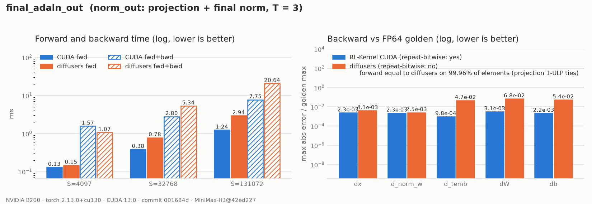
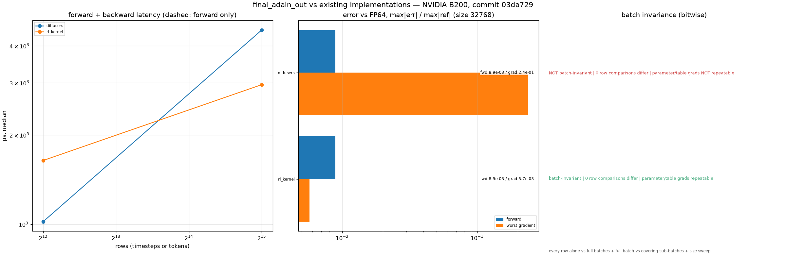

# MiniMax-H3 Final AdaLN Output

## Summary

`final_adaln_out` is H3's `norm_out` (`MiniMaxH3AdaLayerNormOut`), which runs once after the 50
blocks (RFC #420, WS1 step 7):

```text
shift, scale = norm_out.linear(silu(temb).to(bf16)).chunk(2)     # (T, 5376) each, shift first
out = norm_out.norm(x) * (1.0 + scale[timestep_indices]) + shift[timestep_indices]
```

The table has one row per distinct timestep and is indexed by `timestep_indices`, not by
`adaln_indices`. Diffusers then upcasts `out` to the FP32 output heads' dtype. That cast is exact
and is left to the caller.

## Entry Point

```python
op = kernel_registry.get_op("final_adaln_out", device="cuda")
out = op(x, norm_out_norm_w, temb, norm_out_linear_w, norm_out_linear_b, timestep_indices)
```

## Backends

| Backend | Wrapper | Native symbols | Status |
| --- | --- | --- | --- |
| CUDA (SM80+) | `rl_engine.backends.cuda.model_specific.minimax_h3.final_adaln_out.H3FinalAdaLNOutCudaOp` | `rl_engine._C.h3_det_linear_*`, `rl_engine._C.h3_rmsnorm_*` | One autograd node |
| PyTorch reference | `rl_engine.reference.minimax_h3.final_adaln_out.NativeH3FinalAdaLNOutOp` | n/a | `forward`: diffusers replay; `forward_fp32`: FP64 golden |
| ROCm | n/a | n/a | Falls back to the PyTorch reference |

## Numerics

- **Projection.** The [AdaLN projection](h3-adaln-projection.md)'s deterministic tensor-core
  GEMV (`h3-det-linear-bf16-mma-v1`), applied to `norm_out.linear`. The FP32 SiLU is rounded
  once at the declared cast. BF16 `temb` is rejected (probe H7).
- **Norm and modulation.** The [`h3_rmsnorm`](h3-rmsnorm.md) kernel indexed by
  `timestep_indices`. Given the same table, it is bitwise equal to diffusers. Overall, about
  0.04% of output elements differ from diffusers by 1 ULP, all traced to the projection's
  summation tree versus cuBLAS. Rows are batch- and position-invariant.
- **Backward.** One autograd node, so the table gradient (FP32 segment sums) goes straight into
  the projection backward without an extra BF16 rounding:
  - `d_temb`, `dW` and `db` are 22–48× closer to FP64 in the recorded run than diffusers,
    whose error varies from run to run because it rounds the table gradient to BF16 and accumulates it with
    `index_select` atomics;
  - `dx` and `d_norm_w` are at the BF16 rounding level for both;
  - every gradient is repeat-bitwise.
- **Golden.** FP64, rounding only where the model stores a value in its own dtype: the SiLU
  cast, `norm_out.linear`'s BF16 output table, `norm_out.norm`'s BF16 output and the BF16
  `1 + scale`. All four are rounded straight-through for the gradient. The table and `1 + scale`
  are shared by every position of a timestep. Without them the golden's `d_norm_w` drifts
  systematically with S, and the gtest missed it from S = 257. `norm_out.norm`'s rounding
  enters `d_scale`, `dW` and `d_temb` summed over S, and the gtest missed those from S = 1024.

## Performance Notes

```bash
python benchmarks/models/benchmark_h3_conditioning.py --op final_adaln_out
```

B200, B = 1, T = 3, pinned `norm_out` weights:

| S | CUDA fwd | diffusers fwd | CUDA fwd+bwd | diffusers fwd+bwd |
| --- | --- | --- | --- | --- |
| 4097 | 0.13 ms | 0.15 ms | 1.57 ms | 1.07 ms |
| 32768 | 0.38 ms | 0.78 ms | 2.80 ms | 5.34 ms |
| 131072 | 1.24 ms | 2.94 ms | 7.75 ms | 20.6 ms |

At small S the backward is dominated by fixed setup: the stable sort for the segment sums and the
projection backward.

The stored timing evidence includes forward graph setup in the columns labeled
`fwd+bwd`; those values are not backward-only measurements. The current benchmark
prepares the graph outside the timed backward region. Historical timings are retained
with their original commit and corrected scope.

## Evidence



There are two data files:

- [`report.json`](../../reports/experiments/h3-final-adaln-out-b200/report.json): op timings, the
  forward-equality fraction, row invariance and backward accuracy. Regenerated from a clean
  tree at `001684d` on an otherwise idle B200, with FP64 leaves and upstream gradients. The
  backward reference keeps only the SiLU and table roundings, so the errors include the BF16
  rounding of `norm(x)` and `1 + scale`.
- [`chain_replay.json`](../../reports/experiments/h3-final-adaln-out-b200/chain_replay.json): the
  whole conditioning chain (timestep → … → norm_out) replayed stage by stage over
  T in {1, 2, 3, 4} × S in {3, 257, 4097, 32768}, with the backward replay. Written from a clean
  tree at `001684d`.

## Existing implementations (RFC #420 reuse rule)



| Implementation | Batch-invariant | size 4097: fwd err / worst grad err / fwd+bwd | size 32768: fwd err / worst grad err / fwd+bwd |
|---|---|---|---|
| diffusers MiniMaxH3AdaLayerNormOut (op-for-op replay) | **no** (param/table grads not repeatable) | 8.3e-03 / 7.3e-02 / 1021 µs | 8.9e-03 / 2.4e-01 / 4525 µs |
| rl-kernel H3FinalAdaLNOutCudaOp | yes | 8.3e-03 / 5.2e-03 / 1642 µs | 8.9e-03 / 5.7e-03 / 2959 µs |

Errors are max|err| / max|ref| against the same computation in FP64; latency is the median
forward + backward time on an otherwise idle B200. Batch invariance is bitwise and covers
three checks: every row computed alone vs inside full batches of 64, 257 and 2048 rows; the full
131072-token batch vs sub-batches that together cover every row; and a dense batch-size sweep. A
"no" means that at least one row, sub-batch or gradient differed. [`final_adaln_out.json`](../../reports/experiments/h3-prior-art-b200/final_adaln_out.json)
was written from a clean tree at `03da729` by

```bash
python tools/validation/models/h3_prior_art.py --op final_adaln_out --out reports/experiments/h3-prior-art-b200/final_adaln_out.json
python tools/validation/models/plot_h3_prior_art.py reports/experiments/h3-prior-art-b200/final_adaln_out.json
```

Libraries that do not import are skipped and recorded as unavailable in the report.

## Tests

```bash
export RL_KERNEL_H3_WEIGHTS=<dir written by tools/weights/prepare_h3_weights.py>
python -m pytest tests/models/minimax_h3/test_h3_final_adaln_out.py -v       # operator
python -m pytest tests/models/minimax_h3/test_h3_conditioning_e2e.py -v      # end to end: timestep -> ... -> norm_out
python tools/validation/operators/check_operator.py --op final_adaln_out --candidate cuda --device cuda \
    --dtype bf16 --batch 3 --seq 4097 --normalized-dim 5376 --check-grad   # also 257, 1024
python tools/validation/models/h3_evidence.py --op final_adaln_out \
    --out reports/experiments/h3-final-adaln-out-b200/report.json
python tools/validation/models/plot_h3_evidence.py reports/experiments/h3-final-adaln-out-b200/report.json
```

## Known Limitations

- **FP32 gtest at larger S.** H3 runs this op with BF16 activations and weights, and the BF16
  gtest passes at S = 257, 1024 and 4097. With `--dtype fp32` (every input FP32), the FP32
  reduction tolerance (atol = rtol = 1e-4) misses `d_temb` from S = 257 and `dW` from
  S = 1024. Both gradients are FP32 sums over 3·S rows. Where large terms cancel, the
  summation error exceeds the 1e-4 absolute floor. The PyTorch reference misses the same
  gradients at the same S (`--batch 3`, seed 123, max abs error):

  | S | `d_temb` CUDA | `d_temb` PyTorch | `dW` CUDA | `dW` PyTorch |
  | --- | --- | --- | --- | --- |
  | 64 | 9.2e-5 | 1.5e-4 | 1.5e-4 | 9.2e-5 |
  | 257 | 3.1e-4 ✗ | 5.9e-4 ✗ | 8.5e-4 | 2.4e-4 |
  | 1024 | 1.5e-3 ✗ | 2.4e-3 ✗ | 2.0e-3 ✗ | 1.5e-3 ✗ |
  | 4097 | 5.9e-3 ✗ | 9.3e-3 ✗ | 5.9e-3 ✗ | 3.9e-3 ✗ |

  ✗ fails the gtest. Unmarked values above 1e-4 pass through the rtol term. In a PyTorch
  emulation, accumulating only the projection backward in FP64 clears S = 257 but not
  S ≥ 1024, because the segment sums contribute as well. Making every reduction FP64 would
  change the `h3_det_linear` kernels shared with `timestep_mlp_fp32` and
  `adaln_projection_3mod`. The alternative is an FP32 gradient
  tolerance that scales with reduction length. Which of the two to take is an open question
  for the maintainers.
- There is no ROCm kernel. ROCm dispatches the PyTorch reference.
