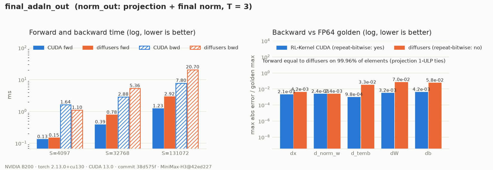

# MiniMax-H3 Final AdaLN Output

## Summary

`final_adaln_out` is H3's `norm_out` (`MiniMaxH3AdaLayerNormOut`), which runs once after the 50
blocks (RFC #420, WS1 step 7):

```text
shift, scale = norm_out.linear(silu(temb).to(bf16)).chunk(2)     # (T, 5376) each, shift first
out = norm_out.norm(x) * (1.0 + scale[timestep_indices]) + shift[timestep_indices]
```

The table has one row per distinct timestep and is indexed by `timestep_indices`, not by
`adaln_indices`. Diffusers then upcasts `out` to the FP32 output heads' dtype. That cast is exact
and is left to the caller.

## Entry Point

```python
op = kernel_registry.get_op("final_adaln_out", device="cuda")
out = op(x, norm_out_norm_w, temb, norm_out_linear_w, norm_out_linear_b, timestep_indices)
```

## Backends

| Backend | Wrapper | Native symbols | Status |
| --- | --- | --- | --- |
| CUDA (SM80+) | `rl_engine.kernels.ops.cuda.h3.final_adaln_out.H3FinalAdaLNOutCudaOp` | `rl_engine._C.h3_det_linear_*`, `rl_engine._C.h3_rmsnorm_*` | One autograd node |
| PyTorch reference | `rl_engine.kernels.ops.pytorch.h3.final_adaln_out.NativeH3FinalAdaLNOutOp` | n/a | `forward`: diffusers replay; `forward_fp32`: FP64 golden |
| ROCm | n/a | n/a | Falls back to the PyTorch reference |

## Numerics

- **Projection.** The [AdaLN projection](h3-adaln-projection.md)'s deterministic tensor-core
  GEMV (`h3-det-linear-bf16-mma-v1`), applied to `norm_out.linear`. The FP32 SiLU is rounded
  once at the declared cast. BF16 `temb` is rejected (probe H7).
- **Norm and modulation.** The [`h3_rmsnorm`](h3-rmsnorm.md) kernel indexed by
  `timestep_indices`. Given the same table, it is bitwise equal to diffusers. Overall, about
  0.04% of output elements differ from diffusers by 1 ULP, all traced to the projection's
  summation tree versus cuBLAS. Rows are batch- and position-invariant.
- **Backward.** One autograd node, so the table gradient (FP32 segment sums) goes straight into
  the projection backward without an extra BF16 rounding:
  - `d_temb`, `dW` and `db` are 13–57× closer to FP64 than diffusers, whose error varies from
    run to run because it rounds the table gradient to BF16 and accumulates it with
    `index_select` atomics;
  - `dx` and `d_norm_w` are at the BF16 rounding level for both;
  - every gradient is repeat-bitwise.
- **Golden.** FP64, rounding only where the model declares a dtype boundary: the SiLU cast,
  and `norm_out.linear`'s BF16 output table, which every position of a timestep shares. Both are
  rounded straight-through for the gradient.

## Performance Notes

```bash
python benchmarks/benchmark_h3_conditioning.py --op final_adaln_out
```

B200, B = 1, T = 3, pinned `norm_out` weights:

| S | CUDA fwd | diffusers fwd | CUDA bwd | diffusers bwd |
| --- | --- | --- | --- | --- |
| 4097 | 0.13 ms | 0.15 ms | 1.64 ms | 1.10 ms |
| 32768 | 0.39 ms | 0.78 ms | 2.88 ms | 5.36 ms |
| 131072 | 1.23 ms | 2.92 ms | 7.80 ms | 20.7 ms |

At small S the backward is dominated by fixed setup: the stable sort for the segment sums and the
projection backward.

## Evidence



There are two data files, both written from a clean tree at commit `38d575f`:

- [`report.json`](../usage/evidence/h3-final-adaln-out-b200/report.json): op timings, the
  forward-equality fraction, row invariance and backward accuracy.
- [`chain_replay.json`](../usage/evidence/h3-final-adaln-out-b200/chain_replay.json): the
  whole conditioning chain (timestep → … → norm_out) replayed stage by stage over
  T in {1, 2, 3, 4} × S in {3, 257, 4097, 32768}, with the backward replay.

## Tests

```bash
export RL_KERNEL_H3_WEIGHTS=<dir written by scripts/prepare_h3_weights.py>
python -m pytest tests/h3/test_h3_final_adaln_out.py -v       # operator
python -m pytest tests/h3/test_h3_conditioning_e2e.py -v      # end to end: timestep -> ... -> norm_out
python scripts/check_operator.py --op final_adaln_out --candidate cuda --device cuda \
    --dtype bf16 --batch 3 --seq 64 --normalized-dim 5376 --check-grad
python scripts/h3_evidence.py --op final_adaln_out \
    --out docs/usage/evidence/h3-final-adaln-out-b200/report.json
python scripts/plot_h3_evidence.py docs/usage/evidence/h3-final-adaln-out-b200/report.json
```

## Known Limitations

- **gtest at larger S.** With `--seq 257`, a few gradient elements fail the per-element
  contract tolerance (BF16 `d_norm_w`, FP32 `d_temb`). Those elements are what is left after
  summing hundreds of rows into values around 1e2, which an absolute per-element atol can't
  cover. Relative to the gradient's maximum the error is 4e-7 in FP32 and 5e-3 in BF16, and the
  PyTorch reference fails the same elements, plus more. `--seq 64` passes in both dtypes.
- There is no ROCm kernel. ROCm dispatches the PyTorch reference.
