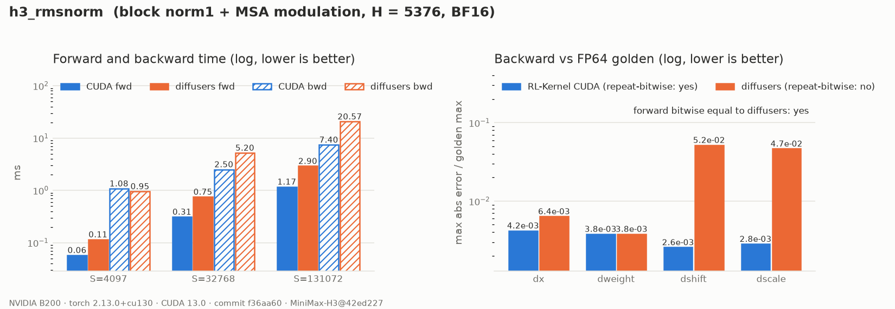

# MiniMax-H3 RMSNorm and AdaLN Modulation

## Summary

`h3_rmsnorm` covers every RMSNorm in MiniMax-H3 (RFC #420, WS1 step 4). That is the block
`norm1`/`norm2`, the token-refiner norms, the refiner `final_norm` and `norm_out.norm`. All of
them are `nn.RMSNorm(5376, eps=1e-5)` with a BF16 affine weight. In a transformer block and in
`norm_out`, the normalised rows are immediately modulated by per-row AdaLN parameters, and the
op fuses that step:

```text
n   = rms_norm(x, weight, eps)
out = n * (1.0 + scale[index]) + shift[index]
```

`index` is `adaln_indices` in a block (rows of the [projection](h3-adaln-projection.md) table)
and `timestep_indices` in `norm_out`. `shift`/`scale` are `(R, H)` row views of the AdaLN table,
gathered inside the kernel, so the `(S, H)` tensors that
[`adaln_row_gather`](h3-adaln-row-gather.md) materialises are never needed.

## Entry Point

```python
op = kernel_registry.get_op("h3_rmsnorm", device="cuda")
n = op(x, weight)                                              # plain RMSNorm
out = op.forward_modulated(x, weight, shift_msa, scale_msa, adaln_indices)
```

## Backends

| Backend | Wrapper | Native symbols | Status |
| --- | --- | --- | --- |
| CUDA (SM80+, validated on SM100) | `rl_engine.kernels.ops.cuda.h3.rmsnorm.H3RMSNormCudaOp` | `rl_engine._C.h3_rmsnorm_{forward,backward}` | Bitwise equal to `nn.RMSNorm` and to the diffusers modulation |
| PyTorch reference | `rl_engine.kernels.ops.pytorch.h3.rmsnorm.NativeH3RMSNormOp` | n/a | `forward*`: provider path; `forward*_fp32`: FP64 golden (the modulated one stores `norm(x)` and `1 + scale` in BF16, straight-through, as the model does) |
| ROCm | n/a | n/a | Falls back to the PyTorch reference |

## Tensor Contract

| Argument | Shape | Dtype | Requirements |
| --- | --- | --- | --- |
| `x` | `(..., S, N)` | bf16 / fp16 / fp32 | `N % 4 == 0`; H3: `N = 5376` |
| `weight` | `(N,)` | `x.dtype` | |
| `shift`, `scale` | `(R, N)` row views, same stride | `x.dtype` | Unit column stride |
| `index` | `(S,)` | int64 | In `[0, R)`; one entry per position, shared across the batch |

Out-of-range indices, mismatched dtypes or shapes, a non-positive eps, and `N % 4 != 0` all fail
closed.

## Numerics

- **Statistics (contract `h3-rmsnorm-v1`).** The kernel replays PyTorch's own
  `vectorized_layer_norm_kernel<T, float, rms_norm>` (torch `cf30153`):
  - one `(32, 4)` block per row, reading 4-element vectors;
  - thread `t` sums vectors `t, t+128, …` in order;
  - a shuffle-down tree (16 → 1), then a cross-warp tree;
  - `rsqrtf(Σx²/N + eps)`, then `w * (rstd * x)` with one cast.

  The plain norm is therefore **bitwise equal to `nn.RMSNorm`**. Rows are independent of batch
  size and position.
- **Modulation.** `1 + scale`, `n * (…)` and `+ shift` are each rounded to the tensor dtype,
  exactly where the eager expression rounds. The fused output is **bitwise equal to diffusers'
  `norm(x) * (1.0 + scale.index_select(0, i)) + shift.index_select(0, i)`**.
- **Backward.** Everything is in FP32 with one cast per output and no atomics:
  - `dx` is row-local, using the same reduction tree;
  - `dweight` is folded over fixed 256-row tiles in ascending order;
  - `dshift`/`dscale` are segmented sums over positions sorted stably by table row, in the
    same scheme as [`adaln_row_gather`](h3-adaln-row-gather.md).

  Diffusers' `index_select` backward accumulates `dshift`/`dscale` with BF16 atomics, so it is
  non-deterministic and about 15–20× less accurate (its error varies from run to run).

## Performance Notes

```bash
python benchmarks/benchmark_h3_conditioning.py --op h3_rmsnorm
```

B200, block `norm1` + MSA modulation, B = 1, H = 5376, BF16:

| S | CUDA fwd | diffusers fwd | CUDA bwd | diffusers bwd |
| --- | --- | --- | --- | --- |
| 4097 | 0.08 ms | 0.12 ms | 1.23 ms | 0.85 ms |
| 32768 | 0.35 ms | 0.76 ms | 2.18 ms | 4.40 ms |
| 131072 | 1.21 ms | 2.90 ms | 6.17 ms | 17.55 ms |

The forward is a single pass that never materialises the gathered rows. At small S the backward
is dominated by the fixed cost of the stable sort and tile setup. Backward timings and peak
memory exclude leaf creation and the forward pass. Candidate/provider execution order alternates
each iteration and is recorded in the report.

## Evidence



The data is in [`report.json`](../usage/evidence/h3-rmsnorm-b200/report.json), written by
`scripts/h3_evidence.py` from a clean tree at commit `80e4609`. It also records:

- bitwise equality with `nn.RMSNorm` for all four pinned norm weights;
- bitwise equality with diffusers for the modulation;
- row invariance.

## Tests

```bash
export RL_KERNEL_H3_WEIGHTS=<dir written by scripts/prepare_h3_weights.py>
python -m pytest tests/h3/test_h3_rmsnorm.py -v               # operator
python -m pytest tests/h3/test_h3_conditioning_e2e.py -v      # end to end, incl. block norm1 + modulation
python scripts/check_operator.py --op h3_rmsnorm --candidate cuda --device cuda \
    --dtype bf16 --batch 2 --seq 257 --normalized-dim 5376 --check-grad
python scripts/h3_evidence.py --op h3_rmsnorm --out docs/usage/evidence/h3-rmsnorm-b200/report.json
python scripts/plot_h3_evidence.py docs/usage/evidence/h3-rmsnorm-b200/report.json
```

## Known Limitations

- Bitwise parity with `nn.RMSNorm` is tied to PyTorch's vectorized layer-norm path (`N % 4 == 0`,
  aligned tensors). Other shapes are rejected rather than approximated.
- The token-refiner blocks' own norm weights live in shard 14, which is not pinned. They are the
  same module (`nn.RMSNorm(5376, eps=1e-5)`) as the four pinned norms tested here.
- There is no ROCm kernel. ROCm dispatches the PyTorch reference.
