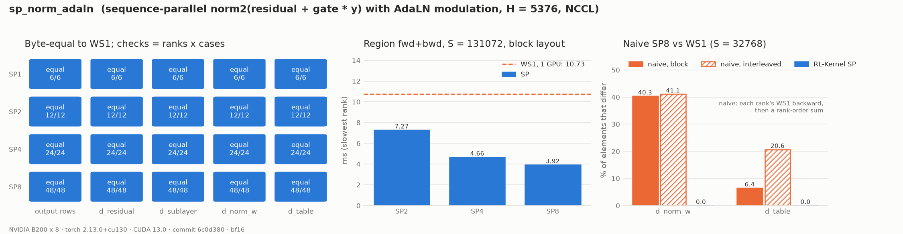

# MiniMax-H3 Sequence-Parallel Norm, AdaLN Modulation and Gated Residual

## Summary

`sp_norm_adaln` runs the row-wise part of an H3 block with the packed sequence split across
sequence-parallel ranks (RFC #420, WS2). It covers the [RMSNorm and AdaLN modulation](h3-rmsnorm.md)
and the [gated residual](h3-adaln-gate-residual.md). Every rank's output and row gradients are the
**WS1 bytes of its rows**. The gradients of the replicated tensors (`d_norm_weight`, `d_shift`,
`d_scale`, `d_gate`) are **the WS1 bytes, identical on every rank**.

## Entry Point

```python
from rl_engine.distributed.collectives import DeterministicCollective
from rl_engine.kernels.ops.cuda.h3.sp_norm_adaln import H3SPNormAdaLNCudaOp

collective = DeterministicCollective(group=sp_group, device=local_rank)
op = H3SPNormAdaLNCudaOp(collective, seq_len=S, batch=B)
rows = slice(op.layout.lo, op.layout.hi)                  # this rank's packed positions
hidden = op.gate_residual(residual[:, rows], attn_out_local, gate_msa, adaln_indices)
normed = op.norm_modulated(hidden, norm2_weight, shift_mlp, scale_mlp, adaln_indices)
final = op.norm_modulated(h, norm_out_weight, shift, scale, timestep_indices)  # norm_out
op.readback()  # sp, rank, positions, collective backend, reduction order, fallback
```

The table views, the norm weight and the full `(S,)` row index are replicated. Activations are
the rank's `(B, S_local, H)` rows.

## Ownership

Rank `r` of `sp` holds packed positions `[r * S // sp, (r + 1) * S // sp)` of every batch item,
together with the matching rows of the metadata. Any `S >= sp` works, including `S` not divisible
by `sp`. Shapes that do not match the rank's slice, a sharded index, an out-of-range index, CPU
tensors and malformed tables all fail closed.

## Numerics

- **Forward and row gradients.** `out`, `dx`, `d_sublayer` and `d_residual` are the WS1 kernels on
  the local rows, with the local slice of the index. Rows are independent, so they are byte-equal
  to WS1.
- **Cross-row gradients.** In WS1, `d_norm_weight` sums `d_n * x * rstd` over fixed 256-row tiles
  of the `B x S` rows. `d_shift`/`d_scale`/`d_gate` sum over 256-element tiles of each table row's
  positions, sorted stably. In both cases the tile partials are then folded in ascending order. SP
  keeps exactly that two-level order:
  1. Every rank builds the global WS1 tile list from the replicated index (`sp_plan`).
  2. Each tile is computed by the rank that holds its first row. Rows of that tile that live on
     other ranks are all-gathered first. Only tiles that cross a shard boundary move rows.
  3. The tile partials (`h3_rmsnorm_backward_partials`, `h3_gate_grad_partials`, the WS1 partial
     kernels over explicit row lists) are all-gathered and put back in WS1 tile order.
  4. Every rank runs the WS1 folds (`h3_rmsnorm_fold_partials`, `h3_gate_grad_fold`).

  The only collectives are rank-ordered all-gathers, which are copies. No collective reduction
  arithmetic is used.

A naive SP backward runs the WS1 backward on each rank's rows and sums the per-rank results. It
changes the reduction tree, so it is not WS1. The evidence measures how often it differs.

The plan depends only on the layout and the index. `H3SPNormAdaLNCudaOp` builds it once per index
object and reuses it for every norm and gated residual that uses the same index, which in a forward
pass is every block.

## Rows Exchanged

How many rows move depends on how the table rows interleave along the sequence:

| Packing | Rows sent per rank (S = 32768, SP8, 4096 rows per rank) |
| --- | --- |
| block (H3's layout: each timestep's text, video and audio tokens contiguous) | 0 – 174 |
| interleaved (modality and timestep random per position; stress case) | 0 – 1536 |

## Evidence



The report is written by `scripts/h3_ws2_evidence.py` from a clean tree at commit `6c0d380`, with
real NCCL processes on one 8 x B200 node, one GPU per rank. The region is
`norm2(residual + gate_msa[row] * y)` with `shift_mlp`/`scale_mlp` modulation, H = 5376, BF16. It
covers six cases: S = 4097 (block, interleaved, B = 2), 32768 (block, interleaved) and 131072
(block). For SP 1, 2, 4 and 8, every rank's output rows, `d_residual` and `d_sublayer`, and its
`d_norm_w` and `d_table`, are byte-equal to WS1 computed on the same GPU.

Forward + backward of the region (slowest rank):

| S, packing | WS1 (1 GPU) | SP2 | SP4 | SP8 |
| --- | --- | --- | --- | --- |
| 4097, block | 2.04 ms | 1.73 ms | 1.88 ms | 2.43 ms |
| 32768, block | 3.72 ms | 2.85 ms | 2.40 ms | 2.72 ms |
| 32768, interleaved | 3.72 ms | 3.45 ms | 3.88 ms | 6.82 ms |
| 131072, block | 10.73 ms | 7.27 ms | 4.66 ms | 3.92 ms |

At long sequences the rows split and the gain grows: 2.74x at SP8 for S = 131072. At short
sequences, each backward's handful of host-synchronising all-gathers (about 0.1 ms each)
dominates. Interleaved packing also moves more rows. A naive SP8 backward (each rank's WS1
backward, then a rank-order sum) differs from WS1 on 40% of `d_norm_w` elements and on 6% (block)
or 21% (interleaved) of `d_table` elements.

## Tests

```bash
python -m pytest tests/h3/test_h3_sp_norm_adaln.py -v   # layout, rank backward, NCCL SP2/4/8
python scripts/h3_ws2_evidence.py --op sp_norm_adaln --worlds 1,2,4,8 \
    --out docs/usage/evidence/h3-sp-norm-adaln-b200/report.json
python scripts/plot_h3_evidence.py docs/usage/evidence/h3-sp-norm-adaln-b200/report.json
```

The rank-backward tests run SP 2–8 on one GPU, with ranks as threads around the plain backward
functions. They cover odd `S`, `B = 2`, shards smaller than a tile, block and interleaved packing,
and bf16 and fp32, and compare every rank against WS1. The NCCL tests run the autograd region end
to end and need as many GPUs as ranks.

## Known Limitations

- CUDA only. `DeterministicCollective` supports world sizes 1, 2, 4 and 8.
- With interleaved packing, up to a full shard of rows can move in the backward. The result is
  still exact.
- Attention and FFN are other rows. Until they land, the region uses a seeded stand-in for the
  sublayer output.
