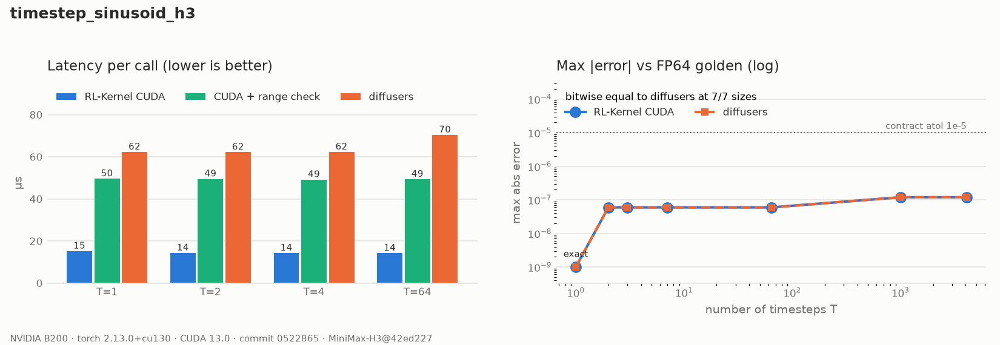

# MiniMax-H3 Timestep Sinusoid

## Summary

`timestep_sinusoid_h3` produces the FP32 sinusoidal timestep features that feed the
MiniMax-H3 timestep MLP (RFC #420, WS1 step 3). H3 builds
`Timesteps(num_channels=256, flip_sin_to_cos=True, downscale_freq_shift=0)` and calls it
on the *distinct* timesteps of the packed sequence, unscaled in `[0, 1]`
(`t = 1 - sigma`):

```text
freq[k]   = exp(-ln(10000) * k / 128)      k = 0..127
arg[t, k] = t * freq[k]
out[t]    = [cos(arg[t]) | sin(arg[t])]    (T, 256), float32
```

Pinned model: `MiniMaxAI/MiniMax-H3@42ed227` (`rl_engine/testing/h3_manifest.json`).
Provider reference: `huggingface/diffusers@f53d552`, `get_timestep_embedding`.

## Entry Point

```python
from rl_engine.kernels.registry import kernel_registry

op = kernel_registry.get_op("timestep_sinusoid_h3", device="cuda")
features = op(timestep)              # timestep: (T,) in [0, 1] -> (T, 256) float32
```

## Backends

| Backend | Wrapper | Native symbol | Status |
| --- | --- | --- | --- |
| CUDA (SM90, SM100) | `rl_engine.kernels.ops.cuda.h3.timestep_sinusoid.H3TimestepSinusoidCudaOp` | `rl_engine._C.h3_timestep_sinusoid_forward` | Bitwise equal to the provider path |
| PyTorch reference | `rl_engine.kernels.ops.pytorch.h3.timestep_sinusoid.NativeH3TimestepSinusoidOp` | n/a | `forward`: provider replay; `forward_fp32`: FP64 golden |
| ROCm | n/a | n/a | Falls back to the PyTorch reference |

## Tensor Contract

| Argument | Shape | Dtype | Requirements |
| --- | --- | --- | --- |
| `timestep` | `(T,)`, `T >= 1` | fp32 / bf16 / fp16 | Finite, in `[0, 1]`; any stride; CUDA for the CUDA backend |
| `num_channels` | scalar | int | Positive and even; H3 uses 256 |
| output | `(T, num_channels)` | float32 | `[cos | sin]` order |

Inputs that break the contract fail closed: non-1-D, empty, integer or out-of-range
timesteps raise. `t * 1000` callers (RFC probe H10) therefore fail instead of
silently producing a different embedding. The range check costs one host read-back;
pass `check_range=False` to `forward` when the caller has already validated `t`.

## Numerics

- **Operation order.** The kernel evaluates exactly the FP32 operations the provider
  runs on CUDA: `(float)(-ln 10000) * k`, multiplied by the FP32 reciprocal of `128`
  (PyTorch divides by a CPU scalar this way), `expf`, `t * freq`, `cosf` and `sinf`.
  The multiplies use `__fmul_rn`, so they are never fused into an FMA. The extension
  is built without `--use_fast_math`, so `expf`, `sinf` and `cosf` are the precise
  libdevice functions.
- **Cast points.** bf16 and fp16 timesteps are upcast to FP32 before anything else,
  matching `timesteps[:, None].float()`. The output is never rounded below FP32.
- **Invariance.** Each output element depends only on `(t, k)`. Results are
  bitwise identical across batch size, position, permutation and repeated runs.
- **Backward.** `d/dt` is the analytic row-local VJP
  (`-f * sin(t f)` for the cos half, `f * cos(t f)` for the sin half). It is summed over
  the 256 channels with a fixed pairwise tree (`tree_sum_lastdim_fp32`), so it does not
  depend on how many timesteps share the launch.

Measured on a B200 (torch 2.13.0+cu130):

| Comparison | Result |
| --- | --- |
| CUDA vs provider path, T in {1, 2, 3, 7, 64, 1000, 4097} | bitwise equal |
| CUDA vs FP64 golden | max abs 1.19e-7 (contract: FP32 elementwise atol 1e-5) |
| gradient vs FP64 golden (gtest, T = 7) | max abs 2.4e-7 |

## Performance Notes

```bash
python benchmarks/benchmark_h3_conditioning.py --op timestep_sinusoid_h3
```

On a B200 this is a single launch of about 15 µs, independent of `T` for `T <= 64`. With
the range check it takes about 51 µs. The provider path takes about 64 µs, because it is
six eager kernels plus two concatenations. Either way the op is launch-bound: it moves
about 1 KB per timestep.

## Evidence



The data is in [`report.json`](../usage/evidence/h3-timestep-sinusoid-b200/report.json).
`scripts/h3_evidence.py` wrote it from a clean tree at commit `0522865`, and the report
records that commit and the environment.

## Tests

```bash
export RL_KERNEL_H3_WEIGHTS=<dir written by scripts/prepare_h3_weights.py>
python -m pytest tests/h3/test_h3_timestep_sinusoid.py -v      # operator
python -m pytest tests/h3/test_h3_conditioning_e2e.py -v       # end to end, pinned weights
python scripts/check_operator.py --op timestep_sinusoid_h3 --candidate cuda --device cuda \
    --dtype fp32 --batch 7 --check-grad
python scripts/h3_evidence.py --op timestep_sinusoid_h3 \
    --out docs/usage/evidence/h3-timestep-sinusoid-b200/report.json
python scripts/plot_h3_evidence.py docs/usage/evidence/h3-timestep-sinusoid-b200/report.json
```

## Known Limitations

- There is no ROCm kernel. ROCm dispatches the PyTorch reference.
- `max_period` is fixed at 10000, the only value H3 uses.
