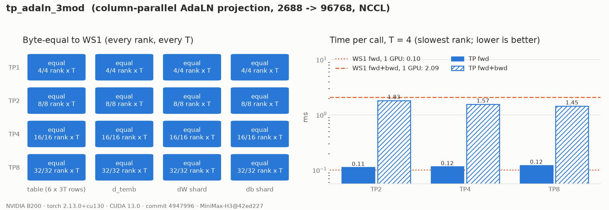

# MiniMax-H3 Tensor-Parallel AdaLN Projection

## Summary

`tp_adaln_3mod` shards the [AdaLN projection](h3-adaln-projection.md) (`2688 -> 96768`, 520 MB of
BF16 weight per block) across tensor-parallel ranks (RFC #420, WS2). Every rank ends with the
**same bytes as the single-GPU (WS1) op**: the six modulation tensors, the `3T` modality rows,
`d_temb`, and its shard of `dW`/`db`.

## Entry Point

```python
from rl_engine.distributed.algorithms.collectives import DeterministicCollective
from rl_engine.backends.cuda.model_specific.minimax_h3.tp_adaln_projection import (
    H3TPAdaLNProjectionCudaOp,
    shard_adaln_projection,
)

collective = DeterministicCollective(group=tp_group, device=local_rank)
op = H3TPAdaLNProjectionCudaOp(collective, n_total=96768)
w_shard, b_shard = shard_adaln_projection(weight, bias, collective.world_size, collective.rank)
shift_msa, scale_msa, gate_msa, shift_mlp, scale_mlp, gate_mlp = op(temb, w_shard, b_shard)
op.readback()  # tp, rank, owned columns/slots, collective backend, kernel ids, fallback
```

## Ownership

Rank `r` of `tp` owns the contiguous output columns `[r * N / tp, (r + 1) * N / tp)` of the
`N = 3 x 6 x 5376` table, which are the same rows of `adaln_proj.linear.weight` and `bias`.
`N / tp` must be a multiple of 64, the `d_input` chunk of contract `h3-det-linear-v1`, so a shard
never splits a WS1 partial sum. TP 1, 2, 3, 4, 6, 7 and 8 qualify. Anything else fails closed when
the op is built.

| TP | Columns per rank | Rank 0 owns |
| --- | --- | --- |
| 2 | 48384 | video: all six chunks; text: shift/scale/gate_msa |
| 4 | 24192 | video: shift_msa .. shift_mlp, half of scale_mlp |
| 8 | 12096 | video: shift_msa, scale_msa, 1344 channels of gate_msa |

`AdaLNColumnShard.slots()` lists each rank's `(modality, chunk, h_begin, h_end)` pieces. The
all-gathered table is the WS1 table, so the six tensors and the `t * 3 + modality` rows are views
of it exactly as in WS1. Nothing downstream needs to know the TP size.

## Numerics

Every floating-point operation is the WS1 kernel itself. The only collective is a rank-ordered
all-gather, which is a copy. No collective reduction arithmetic is used.

- **Forward.** An output column depends only on `silu(temb)` and its own weight row, so the local
  tensor-core GEMV yields exactly the WS1 columns. The all-gather rebuilds the `(T, N)` table.
- **`dW`, `db`.** These are rows of the shard, computed locally with the WS1 ascending-`t` fold.
- **`d_temb`.** WS1 sums `N` in 64-row chunks and then left-folds the chunk partials in ascending
  order. Each rank computes the partials of its own chunks
  (`h3_det_linear_backward_input_partials`), the all-gather puts them in global chunk order, and
  every rank runs the WS1 fold (`h3_det_linear_fold_chunks`) and the FP32 SiLU VJP.

The backward reads its own columns of the table gradient. It therefore requires that gradient to
be identical on every TP rank, as it is when every rank applies the modulation to the same rows.

## Communication

| Direction | Payload per rank | At T = 3, TP = 8 |
| --- | --- | --- |
| forward | `T x N / tp` BF16 | 72.6 KB |
| backward | `(N / 64 / tp) x T x 2688` FP32 | 6.1 MB |

`DeterministicCollective` copies all-gathers whose output is at most 256 KiB with a single-block
byte loop, at about 4 µs per KiB on B200. `ws2_comm.gather_rows` pads such shards just past that
size, where the multi-block path takes about 45 µs. This matters for the forward at small `T`.

## Evidence



The report is written by `tools/validation/models/h3_ws2_evidence.py` from a clean tree at commit `4947996`, with
real NCCL processes on one 8 x B200 node, one GPU per rank, on the pinned block-0 weights. For
TP 1, 2, 4 and 8 and T = 1..4, every rank's table and `d_temb`, and its `dW`/`db` shard, are
byte-equal to WS1 computed on the same GPU.

| T | | WS1 (1 GPU) | TP2 | TP4 | TP8 |
| --- | --- | --- | --- | --- | --- |
| 1 | forward | 0.10 ms | 0.12 ms | 0.11 ms | 0.12 ms |
| 1 | forward + backward | 1.90 ms | 1.49 ms | 1.19 ms | 1.04 ms |
| 3 | forward | 0.10 ms | 0.11 ms | 0.11 ms | 0.12 ms |
| 3 | forward + backward | 2.25 ms | 1.77 ms | 1.48 ms | 1.32 ms |
| 4 | forward + backward | 2.09 ms | 1.83 ms | 1.57 ms | 1.45 ms |

Times are for the slowest rank. The WS1 forward already streams the 520 MB weight at about
5 TB/s, so the TP forward is bounded by the all-gather. `DeterministicCollective` synchronises the
host on every call, which costs about 0.1 ms. The backward is dominated by the shard-local `dW`
and gains 1.7-1.8x at TP8. Each rank also holds only `1 / tp` of the weight and its gradient.

## Tests

```bash
export RL_KERNEL_H3_WEIGHTS=<dir written by tools/weights/prepare_h3_weights.py>
python -m pytest tests/models/minimax_h3/test_h3_tp_adaln.py -v   # ownership, shard arithmetic, NCCL TP2/4/8
python tools/validation/models/h3_ws2_evidence.py --op tp_adaln_3mod --worlds 1,2,4,8 \
    --out reports/experiments/h3-tp-adaln-3mod-b200/report.json
python tools/validation/models/plot_h3_evidence.py reports/experiments/h3-tp-adaln-3mod-b200/report.json
```

The NCCL tests need as many GPUs as ranks and skip otherwise. The shard-arithmetic tests check
the same property on one GPU: each rank's columns and chunk partials equal the matching slice of
the WS1 call, and the fold of the gathered partials equals WS1's `d_input`.

## Known Limitations

- CUDA only. `DeterministicCollective` supports world sizes 1, 2, 4 and 8.
- `norm_out.linear` (`2688 -> 10752`) is not sharded here. It is small and stays replicated.
- There is no ROCm path.
