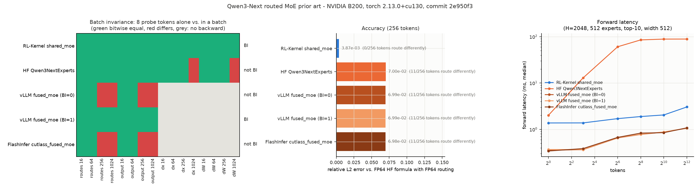

# Qwen3-Next MoE route / combine contract

## Summary

Qwen3-Next's sparse MoE block routes every token to 10 of 512 experts (expert
width 512, TP4-local width 128) and adds a gated shared expert. RFC #428 row
`moe_route_combine_contract` asks for a routed MoE whose output for a token is a
pure function of that token: the same bits whatever else is in the batch, in
training replay and in rollout. This page states the contract and how
`rl_engine.integrations.qwen3_next_forward.shared_moe` meets it.

Upstream references: `transformers` `Qwen3NextSparseMoeBlock` (5.17.0) and vLLM
0.30.0 `fused_topk` + `fused_experts`.

## Entry Point

```python
from rl_engine.integrations.qwen3_next_forward import shared_moe, stable_top10_routes
from rl_engine.integrations.qwen3_next_tp_blocks import TP4MoE

routed, routes = shared_moe(x, router_weight, gate_up, down)  # TP-local, not reduced
block = TP4MoE(group=tp_group, device="cuda")                  # routed + shared, reduced
block.load_hf_weights(hf_layer_mlp_weights)
y = block(hidden)
```

`TRITON_F32_DEFAULT=ieee` must be set before the process starts: the FP32 router
GEMM refuses to run on TF32 Triton dots.

## Contract

| Stage | Order and dtype | Atomics |
| --- | --- | --- |
| Router | BF16 `x`, `W` upcast to FP32; one pinned vLLM batch-invariant GEMM (IEEE FP32) | none |
| Softmax | max subtraction, `exp`, row sum by a fixed pairwise tree (`fixed_order_row_sum`) | none |
| Selection | `argsort(logits, descending, stable)[:, :10]`: score descending, equal scores to the lower expert id | none |
| Weights | the ten selected FP32 probabilities divided by their fixed-tree sum | none |
| Experts | per (token, route) row: `gate_up` GEMM (BF16 in, FP32 accumulate, BF16 out), SwiGLU in FP32, BF16 cast, `down` GEMM | none: one writer per row |
| Combine | `out = e0*w0`, then `out += e_k*w_k` for k = 1..9 in route order, FP32; one BF16 cast | none |
| Shared expert (TP4 block) | `routed + shared * sigmoid(gate)` in BF16, then one TP all-reduce | collective as configured |

Payload dtype between stages: BF16 expert outputs, FP32 route weights, BF16
block output. The expert GEMMs are vLLM 0.30.0's `fused_moe` Triton kernel with
the tile vLLM itself uses under `VLLM_BATCH_INVARIANT=1`
(`BLOCK_SIZE_M/N/K = 64/64/32`, `GROUP_SIZE_M = 8`, `SPLIT_K = 1`), passed
explicitly so no environment variable, tuned-config file or token count can
change it. The routed weight is *not* multiplied inside the kernel and the
kernel does not sum over routes; that stays in the combine above.

Fail-closed checks: CUDA tensors only (no CPU fallback, no ROCm), BF16 weights of
the exact `[512, 2*I, H]` / `[512, H, I]` shapes, finite FP32 router logits,
vLLM exactly 0.30.0, `VLLM_TRITON_USE_TD` off (the tensor-descriptor path is a
different instruction stream), and IEEE Triton FP32.

### Backward

`_RoutedExperts.backward` recomputes the `[gate, up]` projection with the same
grouped kernel, then visits experts in ascending id. Each expert's `dgate_up`
and `ddown` slice is one pinned GEMM written once into a dense buffer; `dx` is
accumulated per token in ascending expert order (a token's ten experts are
distinct, so each launch has unique rows). Router-weight gradients flow through
the selected probabilities; the indices are discrete.

## Reuse decision

| Implementation | Routes BI | Output BI | Backward | Why not reused as is |
| --- | --- | --- | --- | --- |
| vLLM `fused_topk` + `fused_experts`, `VLLM_BATCH_INVARIANT=0` | no | no | none | tuned configs and the BF16 router GEMM depend on the token count |
| vLLM, `VLLM_BATCH_INVARIANT=1` | yes | yes | none | no VJP for training; BF16 router logits (Qwen3-Next and VIME route in FP32); routed weight applied in the expert GEMM epilogue on the BF16 output, then routes summed by `moe_sum` |
| HF `Qwen3NextExperts` (eager) | yes | yes | autograd | `dx`/`dW` change with batch size (cuBLAS shape heuristics); BF16 router; `index_add_` combine in BF16 |
| FlashInfer `cutlass_fused_moe` | (torch routing) | no | none | output changes with batch size; no VJP |
| SGLang, Megatron-core, Transformer Engine | not measured | not measured | - | not installable next to the pinned vLLM 0.30.0 / torch 2.13 runtime |

What RL-Kernel reuses: vLLM's batch-invariant GEMM for the router and the
backward, and vLLM's `fused_moe` Triton kernel for the forward expert GEMMs,
which is batch-invariant per route at the fixed tile. What it implements: the
FP32 fixed-order routing, the stable tie rule, the atomic-free FP32 combine, the
deterministic backward and the TP4 boundaries. The grouped kernel's per-route
output is bitwise equal to the per-expert pinned GEMM loop it replaced
(`tests/check_qwen3_next_forward.py::test_grouped_*`), so this is a speed change
with no change in bits.

## Results

Measured on B200 with `scripts/qwen3_next_moe_prior_art.py` and the TP4 gate
`scripts/qwen3_next_tp_moe_check.py`; the reports, the figure and the exact
commands are in
[`docs/usage/evidence/qwen3-next-moe-route-b200/`](../usage/evidence/qwen3-next-moe-route-b200/README.md).



TP1 shape (H=2048, 512 experts, top-10, width 512), random weights, BF16:

| | RL-Kernel `shared_moe` | vLLM BI=1 | vLLM BI=0 | FlashInfer CUTLASS | HF eager |
| --- | --- | --- | --- | --- | --- |
| routes / output BI (16-1024 tokens) | **yes / yes** | yes / yes | no / no (256+) | no / no (256+) | yes / yes |
| dx / dW BI | **yes / yes** | no backward | no backward | no backward | no / no (1024) |
| rel. L2 error vs FP64 | **3.9e-3** | 7.0e-2 | 7.0e-2 | 7.0e-2 | 7.0e-2 |
| tokens routed unlike FP64 (of 256) | **0** | 11 | 11 | 11 | 11 |
| forward, 1 / 64 / 1024 / 4096 tokens (ms) | 1.38 / 1.71 / 2.05 / 3.05 | 0.37 / 0.66 / 0.88 / 1.06 | 0.36 / 0.65 / 0.87 / 1.06 | 0.34 / 0.67 / 0.85 / 1.08 | 2.0 / 61 / 89 / 89 |
| forward + backward, 64 / 1024 tokens (ms) | 112 / 166 | - | - | - | 878 / 1283 |

* The accuracy gap is the router: every other candidate computes BF16 router
  logits, and 11 of 256 tokens then select a different expert set than FP64
  routing does. RL-Kernel routes in FP32 and selects the same experts.
* RL-Kernel's forward is 2-4x slower than vLLM's. About 0.5 ms of it, at any
  token count, is the FP32 IEEE router GEMM, which is part of the contract.
  The expert GEMMs themselves run in vLLM's kernel. The per-expert GEMM loop
  they replace (same bits) took 47 / 66 / 71 ms at 64 / 1024 / 4096 tokens in
  a local B200 run of the same runner; that run is not part of this evidence.
* The backward is still a per-expert loop of pinned GEMMs (512 experts x 4
  GEMMs) and dominates a training step's MoE time.

TP4 gate on the real layer-0 weights (`tp4-moe/rank-*.json`): all twelve cases
pass on all four ranks, including the round trip of all 512 experts, identical
routes on every rank, full == chunked and reordered batches at 8-1024 tokens,
and identical replicated router gradients. The TP4 block forward (routed +
shared expert + all-reduce) takes 1.9-2.4 ms at 8-1024 tokens.

## Tests

| File | Device | Covers |
| --- | --- | --- |
| `tests/test_qwen3_next_forward_contract.py` | CPU | CPU rejection, vLLM pin, fixed-order sum/softmax row independence |
| `tests/test_qwen3_next_tp_blocks.py` | CPU | HF shard/assemble round trips, replica drift rejection, TP4 parameter ownership |
| `tests/test_tensor_identity.py` | CPU | raw-bit identity (signed zero, NaN/Inf, dtype) |
| `tests/check_qwen3_next_forward.py` | CUDA + vLLM | GEMM batch/chunk/reorder, route ties, combine order, MoE VJP vs FP64, route and output batch invariance, grouped == per-expert bitwise, fail-closed TD path |
| `scripts/qwen3_next_tp_moe_check.py` | 4 x CUDA | real layer-0 weights: HF round trip, replicated routes, chunk/reorder, training forward, gradients |

The `check_` file imports vLLM, so it runs in the `Qwen3-Next-provider-GPU`
workflow rather than the default collection.

## Scope

TP4 with EP1 (all 512 experts on every rank) on CUDA B200. ROCm, EP > 1 and
other TP sizes are separate claims. Model-level parity uses this block but is
the `full_model_chain` row.
