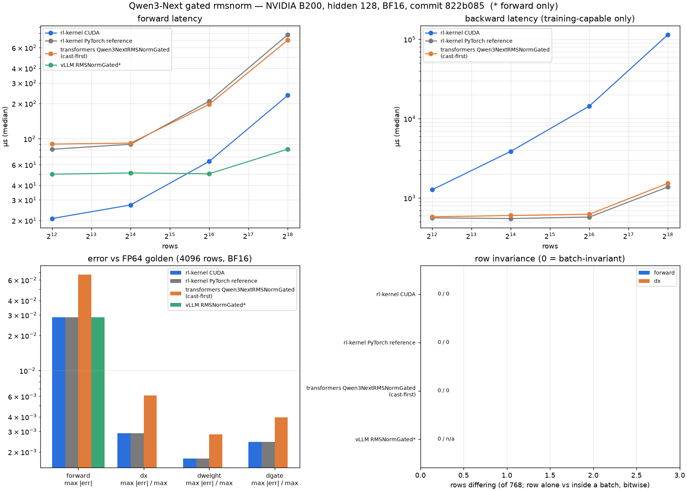
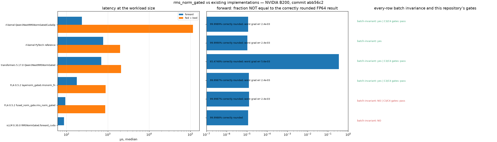

# Qwen3-Next Gated RMSNorm

## Summary

The norm inside Qwen3-Next's Gated DeltaNet block:

```
out = x * rstd * weight * silu(gate)
```

It is a different operator from the decoder norm, not a variant of it: the weight is
plain rather than zero-centred (upstream initializes it to ones), it takes a second
input tensor, and — critically — `transformers` and vLLM disagree about where the
weight multiply happens. See [Qwen3-Next RMSNorm](qwen3-next-rms-norm.md) for the
decoder-norm convention.

Added for RFC #428 C1 on the Qwen3-Next rollout-vs-replay path.

## Entry Point

```python
from rl_engine.kernels.ops.pytorch.norm.qwen3_next_rms_norm import (
    Qwen3NextRMSNormGatedOp,      # strict / vLLM convention
    Qwen3NextRMSNormGatedHFOp,    # transformers convention, kept as a witness
)
from rl_engine.kernels.ops.cuda.norm.rmsnorm import (
    Qwen3NextRMSNormGatedCudaOp,
    rmsnorm_gated_cuda,
)

y = Qwen3NextRMSNormGatedCudaOp().forward(x, weight, gate, eps=1e-6)
y = Qwen3NextRMSNormGatedCudaOp(activation="sigmoid").forward(x, weight, gate, eps=1e-6)
y = rmsnorm_gated_cuda(x, weight, gate, eps=1e-6, activation="sigmoid")
```

## Backends

| Backend | Wrapper | Native symbol | Status |
| --- | --- | --- | --- |
| CUDA | `Qwen3NextRMSNormGatedCudaOp` | `rl_engine._C.rmsnorm_gated_forward` | Supported |
| ROCm | — | — | Not implemented |
| PyTorch fallback | `Qwen3NextRMSNormGatedOp` | — | Supported (WS1 gold) |

The CUDA op is deliberately **not** a subclass of `RMSNormCudaOp`: it takes an extra
required tensor, so it cannot stand in for one.

## Tensor Contract

| Argument | Shape | Dtype | Requirements |
| --- | --- | --- | --- |
| `x` | `[..., H]` | fp32 / bf16 / fp16 | H > 0; wrapper makes contiguous copies |
| `weight` | `[H]` | matches `x` or fp32 | plain, NOT zero-centred |
| `gate` | same as `x` | same as `x` | shape, dtype and device must match before flattening |
| `eps` | scalar | float | `1e-6` for Qwen3-Next |
| `activation` | — | `"silu"`/`"swish"`/`"sigmoid"` | constructor argument; `"swish"` is an alias for `"silu"`, as in vLLM; anything else is rejected |

All tensors must share a device. Low-level CUDA bindings require contiguous
2-D inputs, and validate backward gradient dtype and FP32 statistics. Empty
batches are supported by the bindings.

Only `norm_before_gate=True` and `group_size=None` are implemented — the
configuration vLLM's GDN block constructs. The op has no parameter for either, so
other configurations are not implemented rather than rejected at runtime.

## Dispatch Behavior

Registered as `rms_norm_gated`. CUDA prefers the kernel; every other platform
resolves to the PyTorch reference. `__init__` validates the compiled symbols, so on a
build without the extension the registry falls through instead of returning an op
that raises at call time.

## Accuracy

Claim levels:

- **L1** for `Qwen3NextRMSNormGatedCudaOp`: prefix slices in
  `tests/test_qwen3_next_norm.py`, and batch size, chunking, padding and permutation
  in the C3/C4 gates (`ci/run_ws1_gtest.sh`).
- **L0** is not separately tested for the CUDA op; no test repeats it.
- L2 is not claimed.

Accuracy tests resolve their tolerances from `tolerance_contract.json`
(`forward_accuracy`, `reduction` × dtype). The bounds in
`tests/check_qwen3_next_norm_providers.py` are provider-gap bounds, not contract
thresholds.

`transformers` casts the normalized value back to the input dtype *before* the weight
multiply; vLLM keeps it in fp32. `Qwen3NextRMSNormGatedOp` follows vLLM and
`Qwen3NextRMSNormGatedHFOp` keeps the transformers convention as a witness.
`test_gated_conventions_diverge_in_low_precision` asserts that the two differ in bf16
(by more than `1e-3`) and agree bitwise in fp32. One earlier measurement, with no
committed script, found them differing on 35% of elements with `max|diff| = 6.25e-2`
(one seed, B200, bf16, `head_v_dim=128`, 512 rows, direct eager calls). That is a
one-off observation, not an assertion. Which convention the strict profile should use
is an open question for RFC #428.

"Bitwise equal to vLLM" is undefined until a provider is named. Over 40 seeds (bf16,
`head_v_dim=128`, 512 rows, B200), vLLM's eager `forward_native` and `forward_cuda`
disagreed on 21, worst `1.56e-2`; in fp32 they stay within the asserted `1e-5`. These
figures come from `tests/check_qwen3_next_norm_providers.py`, which imports real vLLM
and must be run explicitly. The PyTorch reference reproduces the convention, not
vLLM's reduction tree.

`rstd` is bitwise identical to the ungated kernel's for the same `x`, asserted over
fp32/fp16/bf16 × H ∈ {128, 2048, 5120} × {silu, sigmoid} × offset ∈ {0, 1}, so a gate
leaking into the statistic would fail.

Backward is assembled from deterministic pieces: `dx` from a row-local kernel,
`dweight` from fp32 row contributions reduced by the ascending-row left fold, and
`dgate` elementwise in fp32 with no reduction.

## Performance Notes

Reuses the existing `block_reduce_sum` / `choose_threads(H)` reduction, so the gate
costs one extra load and one fp32 multiply per element.

```bash
python scripts/check_operator.py --op rms_norm_gated --candidate cuda \
    --device cuda --dtype bf16 --check-grad
```

## Evidence



[`report.json`](../usage/evidence/qwen3-next-rms-norm-gated-b200/report.json) was written by
`scripts/qwen3_next_norm_evidence.py` from a clean tree at `822b085`, on an otherwise idle
B200 (torch 2.13.0+cu130, transformers 5.17.0, vLLM 0.30.0). Head dim 128, BF16; the FP64
golden uses vLLM's convention. The same report re-measures the zero-centred op
([figure](../usage/evidence/qwen3-next-rms-norm-gated-b200/figure-zero_centred_rmsnorm.png)).

| | rl-kernel CUDA | PyTorch reference | transformers (cast-first) | vLLM `RMSNormGated`* |
|---|---|---|---|---|
| rows differing alone vs in a batch, forward / `dx`,`dgate` (of 768) | **0 / 0** | 0 / 0 | 0 / 0 | 0 / n/a |
| forward elements correctly rounded vs the golden | **99.999%** | 99.999% | 65.6% | 99.999% |
| forward, 262144 rows | 235 µs | 774 µs | 697 µs | **81 µs** |
| backward, 262144 rows | 114 ms | **1.4 ms** | 1.5 ms | n/a |

\* forward only, no backward.

- **Every implementation is row-invariant** for this op.
- **transformers computes a different function:** it casts to BF16 before the weight
  multiply, so 34% of its forward elements differ from vLLM's convention, and its gradients
  are about twice as far from the golden.
- **The backward is about 75× slower than transformers at 262144 rows**, for the same reason
  as the zero-centred op: `dweight` (128 columns here) is folded over the rows in ascending
  order, one thread per column, so that it meets the gradient-invariance contract's
  singleton-aggregate check bitwise.

## Existing implementations: batch invariance of every row, accuracy, gates



| Implementation | Batch-invariant | Forward correctly rounded | Worst grad err | Forward / fwd+bwd | C3/C4 gates |
|---|---|---|---|---|---|
| rl-kernel Qwen3NextRMSNormGatedCudaOp | yes | 99.9989% | 2.4e-03 | 235 / 115293 µs | pass |
| rl-kernel PyTorch reference | yes | 99.9990% | 2.4e-03 | 772 / 1991 µs | — |
| transformers 5.17.0 Qwen3NextRMSNormGated | yes | 65.4748% | 5.6e-03 | 695 / 2093 µs | pass |
| FLA 0.5.2 layernorm_gated.rmsnorm_fn | yes | 99.9987% | 2.4e-03 | 177 / 882 µs | pass |
| FLA 0.5.2 fused_norm_gate.rms_norm_gated | **no** (247 sub-batches) | 99.9987% | 2.4e-03 | 93 / 865 µs | pass |
| vLLM 0.30.0 RMSNormGated.forward_cuda | **no** (3 rows, 3 sub-batches) | 99.9988% | — | 87 / — µs | — |

Batch invariance is bitwise and covers three checks: every row computed alone vs inside full
batches of three sizes; the full workload-size batch vs sub-batches that together cover every
row; and a dense batch-size sweep. A "no" counts the rows, sub-batches or sweep cases that
differed. Accuracy is against FP64 at the workload size; latency is the median on an otherwise
idle B200. The C3/C4 column runs this repository's own gate scripts unchanged, with the CUDA
candidate replaced by a subclass of this op whose forward and backward call the other library.
The subclass keeps this op's FP32 `dweight` row contributions, so singleton-aggregate compares
like with like.  [`rms_norm_gated.json`](../usage/evidence/qwen3-next-norm-reuse-b200/rms_norm_gated.json)
was written from a clean tree at `abb56c2` by

```bash
python scripts/qwen3_next_norm_reuse_check.py --op rms_norm_gated \
    --out docs/usage/evidence/qwen3-next-norm-reuse-b200/rms_norm_gated.json [--megatron-src <Megatron-LM checkout>]
```

## Tests

```bash
python -m pytest tests/test_qwen3_next_norm.py -v
# imports real vLLM, so it is not collected by default:
python -m pytest tests/check_qwen3_next_norm_providers.py -v
```

## Known Limitations

- CUDA only; no ROCm, Ascend or Triton backend.
- `norm_before_gate=False` and grouped norms are not implemented.
- Not bitwise against either vLLM path (see Accuracy).
- Measured on sm_100 (B200); RFC #428 §2.2 forbids carrying the claim across
  H100/H200/B100/B200.
