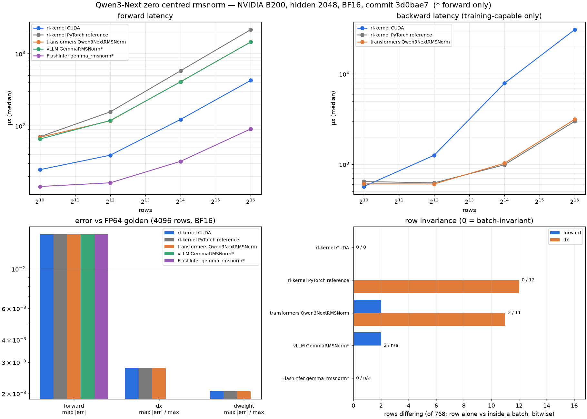
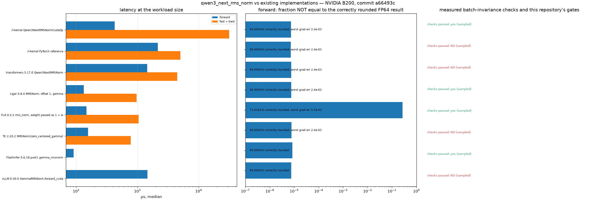

# Qwen3-Next RMSNorm (zero-centred)

## Summary

Qwen3-Next's decoder and final norms store a **zero-centred** weight and compute
`x * rstd * (1 + w)` rather than `x * rstd * w`. The `1 +` is applied in fp32,
after the upcast — folding it into a low-precision weight beforehand rounds the
offset away and silently breaks any bitwise claim.

This operator exists for RFC #428 C1 (Embedding / RMSNorm / residual / final norm
exactness) on the Qwen3-Next rollout-vs-replay path. The Gated DeltaNet block uses
a *different* weight convention and a different cast order; see
[Gated RMSNorm](qwen3-next-rms-norm-gated.md).

Upstream references: `transformers` `Qwen3NextRMSNorm`, and vLLM's `GemmaRMSNorm`,
which `vllm/model_executor/models/qwen3_next.py` aliases as `Qwen3NextRMSNorm`.

## Entry Point

```python
from rl_engine.kernels.ops.pytorch.norm.qwen3_next_rms_norm import Qwen3NextRMSNormOp
from rl_engine.kernels.ops.cuda.norm.rmsnorm import Qwen3NextRMSNormCudaOp, rmsnorm_cuda

y = Qwen3NextRMSNormOp().forward(x, weight, eps=1e-6)       # reference
y = Qwen3NextRMSNormCudaOp().forward(x, weight, eps=1e-6)   # CUDA

# The offset is a kernel parameter, not a pre-pass:
y = rmsnorm_cuda(x, weight, eps=1e-6, weight_offset=1.0)
```

## Backends

| Backend | Wrapper | Native symbol | Status |
| --- | --- | --- | --- |
| CUDA | `Qwen3NextRMSNormCudaOp` | `rl_engine._C.rmsnorm_forward` (`weight_offset=1.0`) | Supported |
| ROCm | — | — | Not implemented |
| PyTorch fallback | `Qwen3NextRMSNormOp` | — | Supported (WS1 gold) |

`Qwen3NextRMSNormOp` subclasses `NativeRMSNormOp` and overrides only
`weight_offset`; the base applies it in fp32.

## Tensor Contract

| Argument | Shape | Dtype | Requirements |
| --- | --- | --- | --- |
| `x` | `[..., H]` | fp32 / bf16 / fp16 | CUDA wrapper copies non-contiguous inputs; low-level `rmsnorm_cuda` requires contiguous inputs |
| `weight` | `[H]` | matches `x` | zero-centred (upstream inits to zeros); CUDA wrapper copies non-contiguous weights; low-level `rmsnorm_cuda` requires contiguous weights |
| `eps` | scalar | float | inside the sqrt; `1e-6` for Qwen3-Next |

## Dispatch Behavior

Registered as the `qwen3_next_rms_norm` gtest operator. On CUDA the registry
prefers `Qwen3NextRMSNormCudaOp`; every other platform resolves to the PyTorch
reference. The CUDA op validates the compiled symbols in `__init__`, so on a build
without the extension construction raises and the registry falls through to the
reference rather than handing out an op that fails at call time.

## Accuracy

Claim levels:

- **L1** (prefix-slice and concurrency) for `Qwen3NextRMSNormCudaOp`; padding,
  packing and order are not tested for the CUDA op.
- **L1** (slice, concurrency and padding) for `Qwen3NextRMSNormOp`.
- **L0** for `Qwen3NextRMSNormOp` only (CPU, fp32); no test repeats the CUDA op.
- L2 is not claimed.

The PyTorch reference uses the repo's fixed 32-wide chunked sum
(`shape_invariant_rstd`, introduced in `8ed1693` as a device-agnostic reference).
On B200, over 20 seeds at `H=2048` in bf16, a plain `mean(-1)` broke slice
invariance on 1 of 20 seeds (slices `x[3:5]` and `x[:1]` of 64 rows; which one
failed was not recorded), and the chunked reduction broke on none. That is a recorded
observation, not an assertion.

The CUDA kernel has its own fixed-order reduction (per-thread strided partial sums,
then `block_reduce_sum`). It is not bitwise equal to the PyTorch reference.

Neither is bitwise equal to vLLM. In one-off probes (not committed checks), the
reference differed from every vLLM path tried (eager, inductor-compiled, and eager
under `VLLM_BATCH_INVARIANT=1`) on 36–39 of 40 seeds, `max|diff| <= 1.56e-2`
(bf16, `H=2048`, 512 rows). The difference is attributed to reduction order, but that
has not been isolated. Only the no-residual call was compared; vLLM's
`fused_add_rms_norm` path (every decoder norm except layer 0's input norm) has no
reference here.

The in-kernel offset is exact, not an approximation: `weight_offset=1.0` is bitwise
equal to passing an explicit fp32 `1 + w` weight, and differs from a bf16-folded
`1 + w`, both asserted.

Accuracy tests resolve their tolerances from `tolerance_contract.json`
(`forward_accuracy`, `reduction` × dtype). The bounds in
`tests/check_qwen3_next_norm_providers.py` are provider-gap bounds, not contract
thresholds.

## Performance Notes

The CUDA path reuses the existing `rmsnorm_fwd_kernel` reduction
(`block_reduce_sum` over `choose_threads(H)`), so the offset costs one fp32 add per
element and no extra memory traffic.

## Evidence



[`report.json`](../usage/evidence/qwen3-next-rms-norm-b200/report.json) was written by
`scripts/qwen3_next_norm_evidence.py` from a clean tree at `3d0bae7`, on an otherwise idle
B200 (torch 2.13.0+cu130, transformers 5.17.0, vLLM 0.30.0, FlashInfer 0.6.18). Hidden 2048,
BF16.

| | rl-kernel CUDA | PyTorch reference | transformers | vLLM `GemmaRMSNorm`* | FlashInfer `gemma_rmsnorm`* |
|---|---|---|---|---|---|
| rows differing alone vs in a batch, forward / `dx` (of 768) | **0 / 0** | 0 / 12 | 2 / 11 | 2 / n/a | 0 / n/a |
| forward, 65536 rows | 425 µs | 2148 µs | 1449 µs | 1449 µs | **90 µs** |
| backward, 65536 rows | 30.9 ms | **3.0 ms** | 3.1 ms | n/a | n/a |

\* forward only, no backward.

- **Accuracy is the same for every implementation:** forward max error 1.56e-2 against the
  FP64 golden (BF16 output rounding; 99.999% of elements correctly rounded), `dx` and
  `dweight` within 2.8e-3 and 2.1e-3 of their maximum.
- **Row invariance:** only this op and FlashInfer give every row the same bits alone and in a
  batch; FlashInfer has no backward. transformers and vLLM differ on 2 forward rows in 768.
- **The backward is about 10× slower than transformers at 65536 rows.** `dweight` is folded
  over rows in ascending order by `reduce_rows_fp32_left_fold`, one thread per column, so
  that the batch `dweight` equals the in-order sum of single-row contributions bitwise (the
  gradient-invariance contract's singleton-aggregate check). That serial fold over rows is
  the cost; a faster tree fold would not pass that check.

## Existing implementations: measured batch invariance, accuracy, gates



| Implementation | Batch-invariance checks | Forward correctly rounded | Worst grad err | Forward / fwd+bwd | C3/C4 gates |
|---|---|---|---|---|---|
| rl-kernel Qwen3NextRMSNormCudaOp | yes (sampled) | 99.9993% | 2.4e-03 | 426 / 31485 µs | see gate table below |
| rl-kernel PyTorch reference | **no** (49 rows, 94 sub-batches) | 99.9993% | 2.4e-03 | 2146 / 5024 µs | — |
| transformers 5.17.0 Qwen3NextRMSNorm | **no** (90 rows, 142 sub-batches) | 99.9992% | 2.4e-03 | 1449 / 4468 µs | see gate table below |
| Liger 0.8.4 RMSNorm, offset 1, gemma | yes (sampled) | 99.9993% | 2.4e-03 | 133 / 974 µs | see gate table below |
| FLA 0.5.2 rms_norm, weight passed as 1 + w | yes (sampled) | 73.0161% | 5.5e-03 | 147 / 1051 µs | see gate table below |
| TE 2.20.2 RMSNorm(zero_centered_gamma) | **no** (175 rows, 245 sub-batches) | 99.9992% | 2.4e-03 | 156 / 779 µs | — |
| FlashInfer 0.6.18.post1 gemma_rmsnorm | yes (sampled) | 99.9992% | — | 91 / — µs | — |
| vLLM 0.30.0 GemmaRMSNorm.forward_cuda | **no** (16 rows, 26 sub-batches) | 99.9992% | — | 1454 / — µs | — |

Batch invariance is bitwise and covers three checks: every row computed alone vs inside full
batches of three sizes; sampled small sub-batches and exhaustive larger sub-batches
of the full workload-size batch; and a batch-size sweep over probe rows. In these
historical reports, sub-batch sizes 1 and 7 visit only 512 starts per seed, so a
"yes (sampled)" does not establish every-row coverage at those sizes. The JSON
records the actual stride and rows checked per size. The current script instead
partitions the full batch at every advertised sub-batch size, covering every row
including a final partial batch. These historical measurements have not been rerun.
A "no" counts the rows, sub-batches or sweep cases that differed. Accuracy is against FP64 at the workload size; latency is the median on an otherwise
idle B200. The C3/C4 column runs this repository's own gate scripts unchanged, with the CUDA
candidate replaced by a subclass of this op whose forward and backward call the other library.
The subclass keeps this op's FP32 `dweight` row contributions, so singleton-aggregate compares
like with like. The C3/C4 results for this op are in the gate table below. [`qwen3_next_rms_norm.json`](../usage/evidence/qwen3-next-norm-reuse-b200/qwen3_next_rms_norm.json)
was originally written from a clean tree at `a66493c` by the command below. The
Megatron `52fbcbc` result has been excluded from the reports, tables and figure:
that revision computes `weight_eff` but uses the original `weight` in its forward
output, so it does not implement the zero-centred operation despite accepting the
flag. The remaining measurements are unchanged; the figure was regenerated from
the corrected report without rerunning benchmarks. The reuse checker now rejects
Megatron implementations that fail a zero-weight probe before benchmarking them.

Original command:

```bash
python scripts/qwen3_next_norm_reuse_check.py --op qwen3_next_rms_norm \
    --out docs/usage/evidence/qwen3-next-norm-reuse-b200/qwen3_next_rms_norm.json [--megatron-src <Megatron-LM checkout>]
```


The gate scripts support this op on this branch. Run unchanged at `88f59f7`, with the CUDA candidate swapped for each implementation ([`qwen3_next_rms_norm_gates.json`](../usage/evidence/qwen3-next-norm-reuse-b200/qwen3_next_rms_norm_gates.json), `scripts/qwen3_next_norm_reuse_check.py --op qwen3_next_rms_norm --checks gates`):

| Implementation swapped into the CUDA candidate | C3 forward | C4 gradient (incl. singleton-aggregate) |
|---|---|---|
| rl-kernel Qwen3NextRMSNormCudaOp | pass | pass |
| transformers 5.17.0 Qwen3NextRMSNorm | pass | **fail** |
| Liger 0.8.4 RMSNorm, offset 1, gemma | pass | pass |
| FLA 0.5.2 rms_norm, weight passed as 1 + w | pass | pass |

## Tests

```bash
python -m pytest tests/test_qwen3_next_norm.py -v
python scripts/check_operator.py --op qwen3_next_rms_norm --candidate cuda \
    --device cuda --dtype bf16 --check-grad
```

## Known Limitations

- CUDA only; no ROCm, Ascend or Triton backend.
- Not bitwise against vLLM (see Accuracy). An L2 claim needs a single source of
  truth for the forward on both sides, per RFC #428 §0 item 1.
- The gated pair (`Qwen3NextRMSNormGatedOp`, `Qwen3NextRMSNormGatedHFOp`) is
  documented with its CUDA kernel on [Gated RMSNorm](qwen3-next-rms-norm-gated.md).
- Measured on sm_100 (B200). Per RFC #428 §2.2 no claim carries across
  H100/H200/B100/B200.
